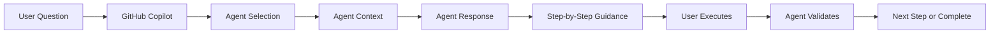

# GitHub Copilot Agents

> Task-specific agents organized by Three Horizons framework + interactive agents for platform operations

## Overview

This directory contains **37 agents** organized into two categories:

### Task-Specific Agents (23) - Horizon-Based
Organized by **Three Horizons** framework. Each agent focuses on **one task** and references **Skills** for tooling.

| Horizon | Agents | Description |
|---------|--------|-------------|
| [h1-foundation/](h1-foundation/) | 8 | Core infrastructure (networking, security, AKS/ARO, databases) |
| [h2-enhancement/](h2-enhancement/) | 5 | Platform capabilities (GitOps, observability, RHDH) |
| [h3-innovation/](h3-innovation/) | 4 | AI/ML and advanced (AI Foundry, MLOps, SRE) |
| [cross-cutting/](cross-cutting/) | 6 | Shared operations (validation, migration, rollback) |

### Interactive Agents (14) - Legacy
General-purpose conversational agents providing:

- **Interactive execution** - Step-by-step guidance via chat
- **Learning-focused** - Understand what each command does
- **Troubleshooting** - Real-time debugging and fixes
- **Manual control** - Execute deployments without GitHub Actions
- **Flexibility** - Customize and adapt to your needs

## Available Agents

### Infrastructure & Platform (7 agents)

| Agent | File | Purpose |
|-------|------|---------|
| **🏗️ Architect** | [architect.agent.md](./architect.agent.md) | System architecture design and patterns |
| **🔧 DevOps** | [devops.agent.md](./devops.agent.md) | CI/CD pipelines, Terraform, Kubernetes operations |
| **☁️ Platform** | [platform.agent.md](./platform.agent.md) | Platform engineering and infrastructure management |
| **🚀 Deployment** | [deployment.agent.md](./deployment.agent.md) | Interactive deployment execution (without workflows) |
| **🔄 Terraform** | [terraform.agent.md](./terraform.agent.md) | Infrastructure as Code with Terraform |
| **🔒 Security** | [security.agent.md](./security.agent.md) | Security scanning, compliance, hardening |
| **👁️ Observability** | [observability.agent.md](./observability.agent.md) | Monitoring, logging, alerting with Prometheus/Grafana |

### Operations & Maintenance (3 agents)

| Agent | File | Purpose |
|-------|------|---------|
| **🚨 SRE** | [sre.agent.md](./sre.agent.md) | Site Reliability Engineering operations |
| **🔍 Reviewer** | [reviewer.agent.md](./reviewer.agent.md) | Code and infrastructure review |
| **📝 Documentation** | [documentation.agent.md](./documentation.agent.md) | Create/update standardized documentation |

### Specialized Operations (4 agents)

| Agent | File | Purpose |
|-------|------|---------|
| **🤖 AI Foundry** | [ai-foundry.agent.md](./ai-foundry.agent.md) | Azure AI Foundry, models, RAG, agents |
| **🔄 GitOps** | [gitops.agent.md](./gitops.agent.md) | ArgoCD operations and GitOps workflows |
| **💰 Cost** | [cost.agent.md](./cost.agent.md) | FinOps, cost optimization, resource rightsizing |
| **🔀 Migration** | [migration.agent.md](./migration.agent.md) | Azure DevOps to GitHub migrations |

**Total: 14 Interactive Agents**

---

## Task-Specific Agents Detail

### H1-Foundation (8 agents)
| Agent | Task | Key Skills |
|-------|------|------------|
| [networking](h1-foundation/networking.agent.md) | Deploy VNet/subnets/NSGs | azure-infrastructure, terraform-cli |
| [security](h1-foundation/security.agent.md) | Deploy Key Vault/RBAC | azure-infrastructure, terraform-cli |
| [infrastructure](h1-foundation/infrastructure.agent.md) | Deploy AKS cluster | azure-infrastructure, kubectl-cli |
| [aro-platform](h1-foundation/aro-platform.agent.md) | Deploy ARO cluster | aro-deployment, openshift-operations |
| [container-registry](h1-foundation/container-registry.agent.md) | Deploy ACR | azure-infrastructure |
| [database](h1-foundation/database.agent.md) | Deploy PostgreSQL/Cosmos | database-management |
| [defender-cloud](h1-foundation/defender-cloud.agent.md) | Enable Defender | azure-infrastructure |
| [purview-governance](h1-foundation/purview-governance.agent.md) | Configure Purview | azure-infrastructure |

### H2-Enhancement (5 agents)
| Agent | Task | Key Skills |
|-------|------|------------|
| [gitops](h2-enhancement/gitops.agent.md) | Configure ArgoCD | argocd-cli, helm-cli |
| [observability](h2-enhancement/observability.agent.md) | Deploy monitoring | observability-stack, helm-cli |
| [rhdh-portal](h2-enhancement/rhdh-portal.agent.md) | Configure Developer Hub | rhdh-portal, openshift-operations |
| [golden-paths](h2-enhancement/golden-paths.agent.md) | Manage templates | rhdh-portal, github-cli |
| [github-runners](h2-enhancement/github-runners.agent.md) | Deploy self-hosted runners | github-cli, helm-cli |

### H3-Innovation (4 agents)
| Agent | Task | Key Skills |
|-------|------|------------|
| [ai-foundry](h3-innovation/ai-foundry.agent.md) | Deploy AI Foundry | ai-foundry-operations |
| [mlops-pipeline](h3-innovation/mlops-pipeline.agent.md) | Configure ML pipelines | ai-foundry-operations |
| [multi-agent](h3-innovation/multi-agent.agent.md) | Setup AI agents | ai-foundry-operations |
| [sre](h3-innovation/sre.agent.md) | Configure SRE automation | ai-foundry-operations, observability-stack |

### Cross-Cutting (6 agents)
| Agent | Task | Key Skills |
|-------|------|------------|
| [validation](cross-cutting/validation.agent.md) | Validate deployments | validation-scripts |
| [migration](cross-cutting/migration.agent.md) | Migrate workloads | terraform-cli, kubectl-cli |
| [rollback](cross-cutting/rollback.agent.md) | Rollback deployments | argocd-cli, kubectl-cli |
| [cost-optimization](cross-cutting/cost-optimization.agent.md) | Optimize costs | azure-infrastructure |
| [identity-federation](cross-cutting/identity-federation.agent.md) | Setup OIDC | azure-infrastructure, github-cli |
| [github-app](cross-cutting/github-app.agent.md) | Configure GitHub App | github-cli |

### Skills Reference

Task-specific agents reference Skills in [.github/skills/](../skills/):
- **CLI Skills**: azure-cli, terraform-cli, kubectl-cli, argocd-cli, helm-cli, github-cli, validation-scripts
- **Domain Skills**: azure-infrastructure, aro-deployment, openshift-operations, observability-stack, database-management, ai-foundry-operations, rhdh-portal

---

## Quick Start

### Using Agents in GitHub Copilot Chat

1. **Start a chat in VS Code** (Cmd/Ctrl + I)

2. **Invoke an agent** using `@<agent-name>` syntax:
   ```
   @deployment Deploy infrastructure for dev environment
   ```

3. **Follow the interactive guidance** - The agent will guide you step-by-step

4. **Execute commands** as provided by the agent

### Example Conversations

**Deploy Infrastructure Interactively**
```
User: @deployment Deploy AKS cluster for staging

Agent: I'll help you deploy AKS infrastructure for staging. Let me guide you through each step:

1. ✅ Prerequisites Check
   Run: az version
   Expected: >= 2.50.0

2. ✅ Environment Setup
   Run: source .env.staging
   
3. ✅ Terraform Init
   Run: cd terraform/ && terraform init
   
[... continues with step-by-step guidance ...]
```

**Troubleshoot Application**
```
User: @observability My app is slow, help me investigate

Agent: Let's investigate the performance issue:

1. Check current pod resource usage:
   kubectl top pods -n production

2. View application logs:
   kubectl logs -n production deployment/my-app --tail=100

3. Check Prometheus metrics:
   [provides specific PromQL queries]
   
[... continues with diagnostic steps ...]
```

**Cost Optimization**
```
User: @cost Analyze our Azure spending

Agent: I'll analyze your Azure costs and provide optimization recommendations:

1. Current month spending:
   [runs az consumption commands]
   
2. Top cost drivers identified:
   - AKS cluster: $2,100/month
   - Storage: $892/month
   
3. Savings opportunities:
   [provides specific actionable recommendations]
```

---

## Agent Features

### Common Capabilities

All agents provide:

✅ **Step-by-step guidance** - Clear instructions for each action  
✅ **Command examples** - Copy-paste ready commands  
✅ **Validation steps** - Verify success after each step  
✅ **Troubleshooting** - Common issues and solutions  
✅ **Best practices** - Industry-standard patterns  
✅ **Integration points** - Works with existing tools  

### Agent-Specific Features

**Deployment Agent**
- Execute 23 Three Horizons agents interactively
- Real-time troubleshooting
- No GitHub Actions required
- Perfect for learning and debugging

**Documentation Agent**
- Create standardized READMEs
- Maintain cross-references
- Update documentation indexes
- Follow Microsoft Writing Style Guide

**AI Foundry Agent**
- Deploy Azure OpenAI models
- Create RAG applications
- Configure content safety
- Monitor AI usage and costs

**GitOps Agent**
- Manage ArgoCD applications
- Configure sync policies
- Troubleshoot sync failures
- Implement progressive delivery

**Cost Agent**
- Analyze Azure spending
- Identify underutilized resources
- Generate savings recommendations
- Set up budget alerts

---

## When to Use Each Agent Type

### Use Interactive Agents (`.github/agents/`) When:

✅ Learning the platform step-by-step  
✅ Troubleshooting deployment issues  
✅ Need to customize deployment flows  
✅ Working in environments without GitHub Actions  
✅ Want to understand what each command does  
✅ Debugging infrastructure or application issues  

### Use Workflow Agents (`/agents/`) When:

✅ Automating deployments  
✅ CI/CD pipeline execution  
✅ Repeatable production deployments  
✅ Multi-environment orchestration  
✅ Hands-off automation is desired  

**Both are valuable!** Interactive agents for learning/debugging, workflow agents for automation.

---

## Agent Architecture

### How Agents Work



### Agent File Structure

Each agent follows this structure:

```markdown
````chatagent
---
name: agent-name
description: Brief description
tools: ['read', 'search', 'edit', 'execute']
model: 'Claude Sonnet 4.5'
infer: true
---

# Agent Name

Agent description and purpose

## Capabilities
What the agent can do

## Common Tasks
Frequent operations with examples

## Best Practices
Industry-standard patterns

## Integration Points
Tools and services used

## Output Format
How the agent responds
````
```

---

## Comparison: Interactive vs Workflow Agents

| Aspect | Interactive Agents (`.github/agents/`) | Workflow Agents (`/agents/`) |
|--------|----------------------------------------|------------------------------|
| **Execution** | Manual via chat | Automated via GitHub Actions |
| **Use Case** | Learning, debugging, customizing | Production automation |
| **Interaction** | Conversational, step-by-step | Fire-and-forget |
| **Control** | Full manual control | Automated execution |
| **Best For** | Education, troubleshooting | CI/CD, repeatable deployments |
| **Speed** | Slower (interactive) | Faster (automated) |
| **Flexibility** | Highly flexible | Standardized flows |

---

## Customization

### Creating Your Own Agent

1. **Copy an existing agent** as a template
2. **Modify the frontmatter**:
   ```yaml
   ---
   name: my-agent
   description: 'My custom agent'
   tools: ['read', 'search', 'edit', 'execute']
   model: 'Claude Sonnet 4.5'
   infer: true
   ---
   ```
3. **Define capabilities and tasks**
4. **Add examples and best practices**
5. **Test with `@my-agent` in chat**

### Extending Existing Agents

Add custom sections:
- Organization-specific procedures
- Custom scripts and tools
- Internal documentation links
- Team-specific workflows

---

## Best Practices

### For Users

1. **Be specific** in your requests - Include environment, resource names, etc.
2. **Follow sequentially** - Complete one step before moving to next
3. **Validate each step** - Run validation commands provided
4. **Ask for clarification** - If unsure, ask the agent to explain
5. **Report errors** - Share error messages for troubleshooting

### For Agent Developers

1. **Clear instructions** - Step-by-step, no ambiguity
2. **Copy-paste commands** - Make execution easy
3. **Include validation** - Always verify success
4. **Provide troubleshooting** - Common issues and fixes
5. **Link to docs** - External resources when needed

---

## Troubleshooting

### Agent Not Found

**Problem:** `Agent @agent-name not found`  
**Solution:** Ensure file exists in `.github/agents/` with `.agent.md` extension

### Agent Not Responding

**Problem:** Agent doesn't provide expected guidance  
**Solution:** 
- Rephrase your question more specifically
- Include context (environment, resource names)
- Check agent's capabilities section

### Commands Failing

**Problem:** Provided commands don't work  
**Solution:**
- Verify prerequisites (tools installed)
- Check environment variables
- Review permissions
- Share error message with agent

---

## Integration with Three Horizons

### Deployment Sequence

Use the **Deployment Agent** to execute the full Three Horizons deployment interactively:

```
Phase 1: H1 Foundation (45-60 min)
@deployment Deploy infrastructure-agent dev
@deployment Deploy networking-agent dev
@deployment Deploy security-agent dev
[... continues ...]

Phase 2: H2 Enhancement (30-45 min)
@deployment Deploy gitops-agent dev
@deployment Deploy observability-agent dev
[... continues ...]

Phase 3: H3 Innovation (40-60 min)
@deployment Deploy ai-foundry-agent prod
@deployment Deploy mlops-pipeline-agent prod
[... continues ...]
```

### Specialized Operations

- **GitOps:** Use `@gitops` for ArgoCD operations
- **Monitoring:** Use `@observability` for debugging issues
- **AI/ML:** Use `@ai-foundry` for AI workloads
- **Cost:** Use `@cost` for optimization
- **Documentation:** Use `@documentation` for docs

---

## Related Documentation

| Document | Description |
|----------|-------------|
| [Workflow Agents](../../agents/README.md) | Automated deployment agents (GitHub Actions) |
| [Deployment Sequence](../../agents/DEPLOYMENT_SEQUENCE.md) | Order of agent execution |
| [Skills](../skills/) | CLI tools and validation scripts |
| [Deployment Guide](../../docs/guides/DEPLOYMENT_GUIDE.md) | Complete deployment walkthrough |

---

## Contributing

To add or improve agents:

1. Create/modify `.agent.md` file in this directory
2. Follow the agent structure template
3. Test with `@agent-name` in chat
4. Update this README with new agent
5. Submit PR to main repository

---

## Support

- **Documentation Issues:** Use `@documentation` agent
- **Deployment Help:** Use `@deployment` agent
- **General Questions:** Use `@platform` or `@devops` agent
- **GitHub Issues:** [Report bugs](https://github.com/your-org/three-horizons-accelerator-v4/issues)

---

**Last Updated:** February 2, 2026  
**Version:** 2.0.0  
**Total Agents:** 37 (23 task-specific + 14 interactive)
