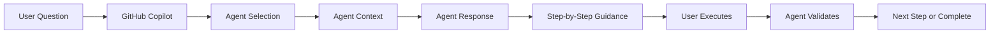

# GitHub Copilot Agents

> 30 specialized agents for Three Horizons Accelerator platform operations

## Overview

This directory contains **30 agents** in a flat structure. Each agent is:
- **Invokable** via `@agent-name` in VS Code Chat
- **Specialized** for a specific domain or task
- **Skill-backed** with CLI references from `.github/skills/`

```
.github/agents/
├── README.md
├── ai-foundry.agent.md      # Azure AI Foundry
├── architect.agent.md       # Architecture design
├── aro.agent.md             # Azure Red Hat OpenShift
├── container-registry.agent.md
├── cost.agent.md            # FinOps
├── database.agent.md        # PostgreSQL/Cosmos
├── defender-cloud.agent.md  # Security Center
├── deployment.agent.md      # Orchestrates deployments
├── devops.agent.md          # CI/CD pipelines
├── documentation.agent.md   # Docs generation
├── github-app.agent.md      # GitHub App config
├── gitops.agent.md          # ArgoCD
├── golden-paths.agent.md    # Software templates
├── governance.agent.md      # Purview/compliance
├── identity.agent.md        # OIDC federation
├── infrastructure.agent.md  # AKS cluster
├── migration.agent.md       # ADO to GitHub
├── mlops-pipeline.agent.md  # ML pipelines
├── multi-agent.agent.md     # AI agent systems
├── networking.agent.md      # VNet/NSG
├── observability.agent.md   # Prometheus/Grafana
├── platform.agent.md        # IDP/RHDH
├── reviewer.agent.md        # Code review
├── rhdh.agent.md            # Developer Hub
├── rollback.agent.md        # Disaster recovery
├── runners.agent.md         # GitHub runners
├── security.agent.md        # Key Vault/RBAC
├── sre.agent.md             # SRE automation
├── terraform.agent.md       # IaC
└── validation.agent.md      # Deployment validation
```

## How Agents Work

```
┌─────────────────────────────────────────────────────────────────────┐
│                         USER                                         │
│                           │                                          │
│      Invokes via @agent-name in VS Code Chat                        │
│                           ▼                                          │
├─────────────────────────────────────────────────────────────────────┤
│                       AGENTS (30)                                    │
│                .github/agents/*.agent.md                             │
│                                                                      │
│  ┌─────────────┐  ┌─────────────┐  ┌─────────────┐                 │
│  │ @deployment │  │ @platform   │  │ @terraform  │  ...            │
│  └──────┬──────┘  └──────┬──────┘  └──────┬──────┘                 │
│         │                │                │                          │
│         └────────────────┴────────────────┘                          │
│                          │                                           │
│         Uses skills for CLI command reference                        │
│                          │                                           │
├──────────────────────────┼──────────────────────────────────────────┤
│                          ▼                                           │
│  ┌───────────────────────────────────────────────────────────────┐  │
│  │                      SKILLS (17)                               │  │
│  │                 .github/skills/*/SKILL.md                      │  │
│  │                                                                │  │
│  │  azure-cli │ terraform-cli │ kubectl-cli │ argocd-cli │ ...  │  │
│  │                                                                │  │
│  │  CLI command reference, patterns, examples                     │  │
│  └───────────────────────────────────────────────────────────────┘  │
└─────────────────────────────────────────────────────────────────────┘
```

### Usage Examples

#### Example 1: Direct Agent Use
```
User: @terraform initialize and apply infrastructure for dev

Agent: I'll help you deploy infrastructure using Terraform. Based on the
       terraform-cli skill, here are the steps:
       
       1. Initialize: terraform init
       2. Plan: terraform plan -var-file=environments/dev.tfvars
       3. Apply: terraform apply -var-file=environments/dev.tfvars
```

#### Example 2: Orchestrated Deployment
```
User: @deployment deploy the full foundation for staging

Agent: I'll orchestrate the foundation deployment:
       
       📦 Using: @networking for VNet/subnets
       🔒 Using: @security for Key Vault/RBAC
       🖥️ Using: @infrastructure for AKS cluster
       
       Phase 1: Networking (from networking.agent.md)
       ─────────────────────────────────────────────
       Prerequisites: Azure CLI 2.50+, Terraform 1.5+
       
       Step 1: terraform init -backend-config=environments/staging/backend.hcl
       Step 2: terraform plan -var-file=environments/staging.tfvars
       Step 3: terraform apply -auto-approve
       
       ✅ Validation: az network vnet list -g rg-staging
       
       [Continues for each component...]
```

#### Example 3: ARO Platform Deployment
```
User: @aro what are the steps to deploy an ARO cluster?

Agent: I'll help you deploy Azure Red Hat OpenShift:
       
       **Prerequisites:**
       - Azure subscription with ARO permissions
       - Red Hat pull secret  
       - Service principal with Contributor role
       
       **Skills Used:** aro-deployment, openshift-operations, oc-cli
       
       **Steps:**
       1. Create resource group
       2. Create virtual network and subnets
       3. Create ARO cluster
       4. Configure OAuth providers
       5. Install required operators
       
       Would you like me to execute these steps?
```

### Agent Capabilities

All 30 agents:
- Can be invoked via `@agent-name` in VS Code Chat
- Have defined skills for CLI command reference
- Provide step-by-step execution with explanations
- Reference other agents for complex workflows
- Include validation steps for each operation

### When to Use Agents

- **Chat & Guidance**: Ask questions about any topic
- **Step-by-step execution**: Get detailed walkthrough  
- **Troubleshooting**: Debug issues interactively
- **Learning**: Understand platform components
- **Automation**: Execute deployment workflows

---

## Available Agents

### Infrastructure & Platform (7 agents)

| Agent | File | Purpose |
|-------|------|---------|
| **🏗️ Architect** | [architect.agent.md](./architect.agent.md) | System architecture design and patterns |
| **🔧 DevOps** | [devops.agent.md](./devops.agent.md) | CI/CD pipelines, Terraform, Kubernetes operations |
| **☁️ Platform** | [platform.agent.md](./platform.agent.md) | Platform engineering and infrastructure management |
| **🚀 Deployment** | [deployment.agent.md](./deployment.agent.md) | Interactive deployment execution (without workflows) |
| **🔄 Terraform** | [terraform.agent.md](./terraform.agent.md) | Infrastructure as Code with Terraform |
| **🔒 Security** | [security.agent.md](./security.agent.md) | Security scanning, compliance, hardening |
| **👁️ Observability** | [observability.agent.md](./observability.agent.md) | Monitoring, logging, alerting with Prometheus/Grafana |

### Operations & Maintenance (3 agents)

| Agent | File | Purpose |
|-------|------|---------|
| **🚨 SRE** | [sre.agent.md](./sre.agent.md) | Site Reliability Engineering operations |
| **🔍 Reviewer** | [reviewer.agent.md](./reviewer.agent.md) | Code and infrastructure review |
| **📝 Documentation** | [documentation.agent.md](./documentation.agent.md) | Create/update standardized documentation |

### Specialized Operations (14 agents)

| Agent | File | Purpose |
|-------|------|---------|
| **🤖 AI Foundry** | [ai-foundry.agent.md](./ai-foundry.agent.md) | Azure AI Foundry, models, RAG, agents |
| **🔄 GitOps** | [gitops.agent.md](./gitops.agent.md) | ArgoCD operations and GitOps workflows |
| **💰 Cost** | [cost.agent.md](./cost.agent.md) | FinOps, cost optimization, resource rightsizing |
| **🔀 Migration** | [migration.agent.md](./migration.agent.md) | Azure DevOps to GitHub migrations |
| **📦 Container Registry** | [container-registry.agent.md](./container-registry.agent.md) | ACR deployment and image management |
| **🗄️ Database** | [database.agent.md](./database.agent.md) | PostgreSQL/Cosmos DB operations |
| **🌐 Networking** | [networking.agent.md](./networking.agent.md) | VNet, NSG, and endpoint management |
| **📋 Governance** | [governance.agent.md](./governance.agent.md) | Purview and compliance configuration |
| **🎯 ARO** | [aro.agent.md](./aro.agent.md) | Azure Red Hat OpenShift operations |
| **🏠 RHDH** | [rhdh.agent.md](./rhdh.agent.md) | Developer Hub portal management |
| **✨ Golden Paths** | [golden-paths.agent.md](./golden-paths.agent.md) | Software template management |
| **🏃 Runners** | [runners.agent.md](./runners.agent.md) | GitHub self-hosted runners |
| **🔐 Identity** | [identity.agent.md](./identity.agent.md) | Workload identity federation |
| **⏪ Rollback** | [rollback.agent.md](./rollback.agent.md) | Deployment rollback and recovery |

**Total: 30 Agents**

---

## Additional Agents

| Agent | File | Purpose |
|-------|------|---------|
| **🛡️ Defender Cloud** | [defender-cloud.agent.md](./defender-cloud.agent.md) | Microsoft Defender for Cloud configuration |
| **🔧 Infrastructure** | [infrastructure.agent.md](./infrastructure.agent.md) | Core infrastructure deployment |
| **🔧 GitHub App** | [github-app.agent.md](./github-app.agent.md) | GitHub App configuration |
| **🤖 MLOps Pipeline** | [mlops-pipeline.agent.md](./mlops-pipeline.agent.md) | ML pipeline operations |
| **🤖 Multi-Agent** | [multi-agent.agent.md](./multi-agent.agent.md) | AI multi-agent orchestration |
| **✅ Validation** | [validation.agent.md](./validation.agent.md) | Deployment validation |

### Skills Reference

All agents reference Skills in [.github/skills/](../skills/):
- **CLI Skills**: azure-cli, terraform-cli, kubectl-cli, argocd-cli, helm-cli, github-cli, oc-cli
- **Domain Skills**: azure-infrastructure, aro-deployment, openshift-operations, observability-stack, database-management, ai-foundry-operations, rhdh-portal, validation-scripts, mcp-cli, prerequisites

---

## Quick Start

### Using Agents in GitHub Copilot Chat

1. **Start a chat in VS Code** (Cmd/Ctrl + I)

2. **Invoke an agent** using `@<agent-name>` syntax:
   ```
   @deployment Deploy infrastructure for dev environment
   ```

3. **Follow the interactive guidance** - The agent will guide you step-by-step

4. **Execute commands** as provided by the agent

### Example Conversations

**Deploy Infrastructure Interactively**
```
User: @deployment Deploy AKS cluster for staging

Agent: I'll help you deploy AKS infrastructure for staging. Let me guide you through each step:

1. ✅ Prerequisites Check
   Run: az version
   Expected: >= 2.50.0

2. ✅ Environment Setup
   Run: source .env.staging
   
3. ✅ Terraform Init
   Run: cd terraform/ && terraform init
   
[... continues with step-by-step guidance ...]
```

**Troubleshoot Application**
```
User: @observability My app is slow, help me investigate

Agent: Let's investigate the performance issue:

1. Check current pod resource usage:
   kubectl top pods -n production

2. View application logs:
   kubectl logs -n production deployment/my-app --tail=100

3. Check Prometheus metrics:
   [provides specific PromQL queries]
   
[... continues with diagnostic steps ...]
```

**Cost Optimization**
```
User: @cost Analyze our Azure spending

Agent: I'll analyze your Azure costs and provide optimization recommendations:

1. Current month spending:
   [runs az consumption commands]
   
2. Top cost drivers identified:
   - AKS cluster: $2,100/month
   - Storage: $892/month
   
3. Savings opportunities:
   [provides specific actionable recommendations]
```

---

## Agent Features

### Common Capabilities

All agents provide:

✅ **Step-by-step guidance** - Clear instructions for each action  
✅ **Command examples** - Copy-paste ready commands  
✅ **Validation steps** - Verify success after each step  
✅ **Troubleshooting** - Common issues and solutions  
✅ **Best practices** - Industry-standard patterns  
✅ **Integration points** - Works with existing tools  

### Agent-Specific Features

**Deployment Agent**
- Execute 23 Three Horizons agents interactively
- Real-time troubleshooting
- No GitHub Actions required
- Perfect for learning and debugging

**Documentation Agent**
- Create standardized READMEs
- Maintain cross-references
- Update documentation indexes
- Follow Microsoft Writing Style Guide

**AI Foundry Agent**
- Deploy Azure OpenAI models
- Create RAG applications
- Configure content safety
- Monitor AI usage and costs

**GitOps Agent**
- Manage ArgoCD applications
- Configure sync policies
- Troubleshoot sync failures
- Implement progressive delivery

**Cost Agent**
- Analyze Azure spending
- Identify underutilized resources
- Generate savings recommendations
- Set up budget alerts

---

## When to Use Agents

### Use Agents When:

✅ Learning the platform step-by-step  
✅ Troubleshooting deployment issues  
✅ Need to customize deployment flows  
✅ Working in environments without GitHub Actions  
✅ Want to understand what each command does  
✅ Debugging infrastructure or application issues  
✅ Automating deployments interactively
✅ Multi-environment orchestration with guidance

---

## Agent Architecture

### How Agents Work



### Agent File Structure

Each agent follows this structure:

```markdown
````chatagent
---
name: agent-name
description: Brief description
tools: ['read', 'search', 'edit', 'execute']
model: 'Claude Sonnet 4.5'
infer: true
---

# Agent Name

Agent description and purpose

## Capabilities
What the agent can do

## Common Tasks
Frequent operations with examples

## Best Practices
Industry-standard patterns

## Integration Points
Tools and services used

## Output Format
How the agent responds
````
```

---

## Customization

### Creating Your Own Agent

1. **Copy an existing agent** as a template
2. **Modify the frontmatter**:
   ```yaml
   ---
   name: my-agent
   description: 'My custom agent'
   tools: ['read', 'search', 'edit', 'execute']
   model: 'Claude Sonnet 4.5'
   infer: true
   ---
   ```
3. **Define capabilities and tasks**
4. **Add examples and best practices**
5. **Test with `@my-agent` in chat**

### Extending Existing Agents

Add custom sections:
- Organization-specific procedures
- Custom scripts and tools
- Internal documentation links
- Team-specific workflows

---

## Best Practices

### For Users

1. **Be specific** in your requests - Include environment, resource names, etc.
2. **Follow sequentially** - Complete one step before moving to next
3. **Validate each step** - Run validation commands provided
4. **Ask for clarification** - If unsure, ask the agent to explain
5. **Report errors** - Share error messages for troubleshooting

### For Agent Developers

1. **Clear instructions** - Step-by-step, no ambiguity
2. **Copy-paste commands** - Make execution easy
3. **Include validation** - Always verify success
4. **Provide troubleshooting** - Common issues and fixes
5. **Link to docs** - External resources when needed

---

## Troubleshooting

### Agent Not Found

**Problem:** `Agent @agent-name not found`  
**Solution:** Ensure file exists in `.github/agents/` with `.agent.md` extension

### Agent Not Responding

**Problem:** Agent doesn't provide expected guidance  
**Solution:** 
- Rephrase your question more specifically
- Include context (environment, resource names)
- Check agent's capabilities section

### Commands Failing

**Problem:** Provided commands don't work  
**Solution:**
- Verify prerequisites (tools installed)
- Check environment variables
- Review permissions
- Share error message with agent

---

## Integration with Three Horizons

### Deployment Sequence

Use the **Deployment Agent** to execute the full Three Horizons deployment interactively:

```
Phase 1: H1 Foundation (45-60 min)
@deployment Deploy infrastructure-agent dev
@deployment Deploy networking-agent dev
@deployment Deploy security-agent dev
[... continues ...]

Phase 2: H2 Enhancement (30-45 min)
@deployment Deploy gitops-agent dev
@deployment Deploy observability-agent dev
[... continues ...]

Phase 3: H3 Innovation (40-60 min)
@deployment Deploy ai-foundry-agent prod
@deployment Deploy mlops-pipeline-agent prod
[... continues ...]
```

### Specialized Operations

- **GitOps:** Use `@gitops` for ArgoCD operations
- **Monitoring:** Use `@observability` for debugging issues
- **AI/ML:** Use `@ai-foundry` for AI workloads
- **Cost:** Use `@cost` for optimization
- **Documentation:** Use `@documentation` for docs

---

## Related Documentation

| Document | Description |
|----------|-------------|
| [Skills](../skills/) | CLI tools and validation scripts |
| [Prompts](../prompts/) | Pre-defined prompts for common tasks |
| [Instructions](../instructions/) | Project-specific conventions |
| [Deployment Guide](../../docs/guides/DEPLOYMENT_GUIDE.md) | Complete deployment walkthrough |

---

## Contributing

To add or improve agents:

1. Create/modify `.agent.md` file in this directory
2. Follow the agent structure template
3. Test with `@agent-name` in chat
4. Update this README with new agent
5. Submit PR to main repository

---

## Support

- **Documentation Issues:** Use `@documentation` agent
- **Deployment Help:** Use `@deployment` agent
- **General Questions:** Use `@platform` or `@devops` agent
- **GitHub Issues:** [Report bugs](https://github.com/your-org/three-horizons-accelerator-v4/issues)

---

**Last Updated:** February 2, 2026  
**Version:** 4.0.0  
**Total Agents:** 30 (flat structure)
