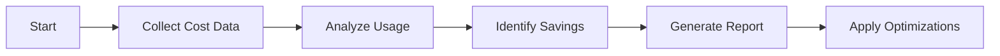

# Cost Optimization Agent

## Task
Analyze Azure spending and recommend cost optimizations.

## Skills Reference
- **[azure-infrastructure](../../skills/azure-infrastructure/)** - Resource analysis
- **[validation-scripts](../../skills/validation-scripts/)** - Cost validation

## Workflow



## Commands

### View Cost Analysis
```bash
az consumption usage list \
  --start-date $(date -v-30d +%Y-%m-%d) \
  --end-date $(date +%Y-%m-%d) \
  --output table
```

### Get Advisor Recommendations
```bash
az advisor recommendation list \
  --category cost \
  --output table
```

### Apply Reserved Instances
```bash
az reservations reservation-order purchase \
  --sku Standard_D4s_v3 \
  --location eastus \
  --term P1Y \
  --quantity 3
```

## Optimization Categories

| Category | Actions |
|----------|---------|
| Right-sizing | Resize over-provisioned VMs |
| Reserved Instances | Purchase RIs for stable workloads |
| Spot Instances | Use spot for fault-tolerant workloads |
| Storage Tiers | Move cold data to archive storage |
| Orphan Resources | Delete unused resources |

## Parameters

| Parameter | Required | Default | Description |
|-----------|----------|---------|-------------|
| subscription_id | No | current | Target subscription |
| days | No | 30 | Analysis period |
| apply | No | false | Apply recommendations |

## Dependencies
- Cost Management Reader role

## Triggers Next
- Infrastructure updates based on recommendations
