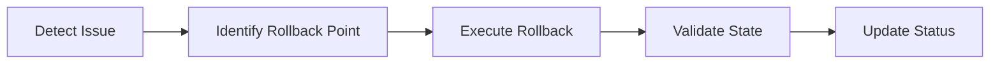

# Rollback Agent

## Task
Rollback infrastructure or application deployments to previous state.

## Skills Reference
- **[argocd-cli](../../skills/argocd-cli/)** - Application rollback
- **[kubectl-cli](../../skills/kubectl-cli/)** - Kubernetes rollback
- **[terraform-cli](../../skills/terraform-cli/)** - Infrastructure rollback
- **[validation-scripts](../../skills/validation-scripts/)** - Rollback validation

## Workflow



## Commands

### ArgoCD Rollback
```bash
# List history
argocd app history ${APP_NAME}

# Rollback to revision
argocd app rollback ${APP_NAME} ${REVISION}
```

### Kubernetes Rollback
```bash
# Rollback deployment
kubectl rollout undo deployment/${DEPLOYMENT} -n ${NAMESPACE}

# Rollback to specific revision
kubectl rollout undo deployment/${DEPLOYMENT} --to-revision=${REV}
```

### Terraform Rollback
```bash
# Use previous state
git checkout HEAD~1 -- terraform/
terraform init
terraform apply -auto-approve
```

### Helm Rollback
```bash
# List releases
helm history ${RELEASE} -n ${NAMESPACE}

# Rollback
helm rollback ${RELEASE} ${REVISION} -n ${NAMESPACE}
```

## Parameters

| Parameter | Required | Default | Description |
|-----------|----------|---------|-------------|
| component | Yes | - | Component to rollback |
| revision | No | previous | Target revision |
| validate | No | true | Validate after rollback |

## Dependencies
- Previous successful deployment state

## Triggers Next
- `validation-agent` (Verify rollback success)
