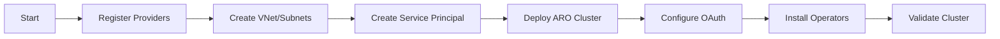

# ARO Platform Agent

## Task
Deploy and configure Azure Red Hat OpenShift (ARO) cluster as enterprise Kubernetes platform.

## Skills Reference
- **[aro-deployment](../../skills/aro-deployment/)** - Full ARO deployment workflow
- **[openshift-operations](../../skills/openshift-operations/)** - oc CLI and operators
- **[terraform-cli](../../skills/terraform-cli/)** - Infrastructure as code
- **[validation-scripts](../../skills/validation-scripts/)** - Cluster validation

## Workflow



## Commands

### Deploy ARO (Script)
```bash
./scripts/deploy-aro.sh \
  --cluster-name aro-${ENV} \
  --resource-group rg-aro-${ENV} \
  --location ${LOCATION} \
  --pull-secret ./pull-secret.txt \
  --sizing-profile ${SIZING_PROFILE} \
  --enable-gitops \
  --enable-rhdh
```

### Manual Login
```bash
# Get credentials
API_SERVER=$(az aro show -g ${RG} -n ${ARO} --query apiserverProfile.url -o tsv)
PASSWORD=$(az aro list-credentials -g ${RG} -n ${ARO} --query kubeadminPassword -o tsv)

# Login
oc login ${API_SERVER} -u kubeadmin -p ${PASSWORD}
```

### Validate
```bash
oc get nodes
oc get clusteroperators
./scripts/validate-deployment.sh --platform aro
```

## Parameters

| Parameter | Required | Default | Description |
|-----------|----------|---------|-------------|
| cluster_name | Yes | - | ARO cluster name |
| location | Yes | - | Azure region |
| pull_secret | Yes | - | Red Hat pull secret path |
| sizing_profile | No | medium | small/medium/large/xlarge |
| enable_gitops | No | true | Install OpenShift GitOps |
| enable_rhdh | No | true | Install Developer Hub |

## Dependencies
- Red Hat pull secret from console.redhat.com
- Sufficient Azure quota for DCSv3 VMs

## Triggers Next
- `rhdh-portal-agent` (Configure Developer Hub)
- `gitops-agent` (Configure ArgoCD apps)
- `observability-agent` (Monitoring setup)

## Platform Choice
For **AKS** instead of ARO, use `infrastructure-agent`.
