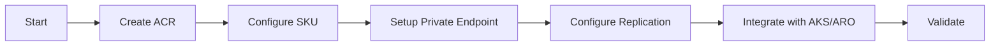

# Container Registry Agent

## Task
Deploy and configure Azure Container Registry (ACR) with security and integration settings.

## Skills Reference
- **[azure-infrastructure](../../skills/azure-infrastructure/)** - ACR provisioning
- **[terraform-cli](../../skills/terraform-cli/)** - Infrastructure as code
- **[validation-scripts](../../skills/validation-scripts/)** - Registry validation

## Workflow



## Commands

### Deploy ACR
```bash
cd terraform/environments/${ENV}
terraform plan -target=module.container_registry -out=acr.tfplan
terraform apply acr.tfplan
```

### Integrate with AKS
```bash
az aks update \
  --resource-group ${RESOURCE_GROUP} \
  --name ${AKS_NAME} \
  --attach-acr ${ACR_NAME}
```

### Integrate with ARO
```bash
# Create pull secret
oc create secret docker-registry acr-pull-secret \
  --docker-server=${ACR_NAME}.azurecr.io \
  --docker-username=${ACR_USERNAME} \
  --docker-password=${ACR_PASSWORD} \
  -n openshift-config
```

## Parameters

| Parameter | Required | Default | Description |
|-----------|----------|---------|-------------|
| environment | Yes | - | dev, staging, prod |
| sku | No | Premium | Basic/Standard/Premium |
| geo_replication | No | false | Enable geo-replication |
| admin_enabled | No | false | Enable admin user |

## Dependencies
- `networking-agent` (Private endpoints)

## Triggers Next
- `infrastructure-agent` (AKS integration)
- `aro-platform-agent` (ARO integration)
