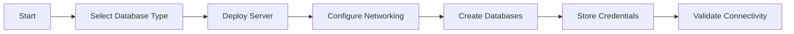

# Database Agent

## Task
Deploy and configure managed database services (PostgreSQL, Cosmos DB).

## Skills Reference
- **[database-management](../../skills/database-management/)** - Database operations
- **[azure-infrastructure](../../skills/azure-infrastructure/)** - Resource provisioning
- **[terraform-cli](../../skills/terraform-cli/)** - Infrastructure as code
- **[validation-scripts](../../skills/validation-scripts/)** - Database validation

## Workflow



## Commands

### Deploy PostgreSQL
```bash
cd terraform/environments/${ENV}
terraform plan -target=module.databases -out=db.tfplan
terraform apply db.tfplan
```

### Manual PostgreSQL
```bash
az postgres flexible-server create \
  --resource-group ${RESOURCE_GROUP} \
  --name psql-${PROJECT}-${ENV} \
  --location ${LOCATION} \
  --admin-user ${ADMIN_USER} \
  --admin-password "${ADMIN_PASSWORD}" \
  --sku-name Standard_D4ds_v4 \
  --version 16 \
  --high-availability ZoneRedundant
```

### Validate
```bash
az postgres flexible-server connect \
  --name ${POSTGRES_SERVER} \
  --admin-user ${ADMIN_USER} \
  --admin-password "${ADMIN_PASSWORD}" \
  --database-name postgres
```

## Parameters

| Parameter | Required | Default | Description |
|-----------|----------|---------|-------------|
| database_type | Yes | - | postgresql, cosmosdb |
| environment | Yes | - | dev, staging, prod |
| high_availability | No | true | Zone redundant HA |
| backup_retention | No | 35 | Backup retention days |

## Dependencies
- `networking-agent` (VNet integration)
- `security-agent` (Key Vault for credentials)

## Triggers Next
- `rhdh-portal-agent` (RHDH needs PostgreSQL)
