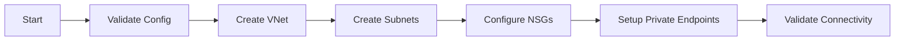

# Networking Agent

## Task
Deploy and configure Azure networking infrastructure including VNets, subnets, NSGs, and private endpoints.

## Skills Reference
- **[azure-infrastructure](../../skills/azure-infrastructure/)** - VNet, subnet, NSG provisioning
- **[terraform-cli](../../skills/terraform-cli/)** - Infrastructure as code
- **[validation-scripts](../../skills/validation-scripts/)** - Network validation

## Workflow



## Commands

### Deploy Networking
```bash
cd terraform/environments/${ENV}
terraform init
terraform plan -target=module.networking -out=network.tfplan
terraform apply network.tfplan
```

### Validate
```bash
./scripts/validate-deployment.sh --component networking
```

## Parameters

| Parameter | Required | Default | Description |
|-----------|----------|---------|-------------|
| environment | Yes | - | dev, staging, prod |
| location | Yes | - | Azure region |
| vnet_cidr | No | 10.0.0.0/16 | VNet address space |
| enable_bastion | No | false | Deploy Azure Bastion |

## Dependencies
- Resource group must exist
- Subscription must have network quotas

## Triggers Next
- `infrastructure-agent` (AKS/ARO deployment)
- `security-agent` (Key Vault with private endpoints)
