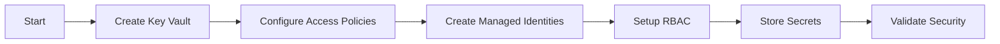

# Security Agent

## Task
Deploy and configure Azure security infrastructure including Key Vault, Managed Identities, and RBAC.

## Skills Reference
- **[azure-infrastructure](../../skills/azure-infrastructure/)** - Security resource provisioning
- **[terraform-cli](../../skills/terraform-cli/)** - Infrastructure as code
- **[validation-scripts](../../skills/validation-scripts/)** - Security validation

## Workflow



## Commands

### Deploy Security
```bash
cd terraform/environments/${ENV}
terraform plan -target=module.security -out=security.tfplan
terraform apply security.tfplan
```

### Store Secret
```bash
az keyvault secret set \
  --vault-name ${KEY_VAULT_NAME} \
  --name ${SECRET_NAME} \
  --value "${SECRET_VALUE}"
```

## Parameters

| Parameter | Required | Default | Description |
|-----------|----------|---------|-------------|
| environment | Yes | - | dev, staging, prod |
| enable_purge_protection | No | true | Prevent accidental deletion |
| enable_soft_delete | No | true | Enable soft delete |

## Dependencies
- Networking must be deployed (private endpoints)

## Triggers Next
- `infrastructure-agent` (AKS/ARO needs Key Vault)
- `database-agent` (DB credentials in Key Vault)
