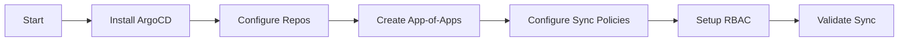

# GitOps Agent

## Task
Configure ArgoCD/OpenShift GitOps for declarative continuous delivery.

## Skills Reference
- **[argocd-cli](../../skills/argocd-cli/)** - ArgoCD operations
- **[helm-cli](../../skills/helm-cli/)** - Helm chart management
- **[kubectl-cli](../../skills/kubectl-cli/)** - Kubernetes operations
- **[validation-scripts](../../skills/validation-scripts/)** - GitOps validation

## Workflow



## Commands

### Install ArgoCD (AKS)
```bash
kubectl create namespace argocd
kubectl apply -n argocd -f https://raw.githubusercontent.com/argoproj/argo-cd/stable/manifests/install.yaml
```

### OpenShift GitOps (ARO)
```bash
oc apply -f - <<EOF
apiVersion: operators.coreos.com/v1alpha1
kind: Subscription
metadata:
  name: openshift-gitops-operator
  namespace: openshift-operators
spec:
  channel: latest
  name: openshift-gitops-operator
  source: redhat-operators
  sourceNamespace: openshift-marketplace
EOF
```

### Configure Repository
```bash
argocd repo add https://github.com/${ORG}/${REPO}.git \
  --username ${GH_USER} \
  --password ${GH_TOKEN}
```

### Deploy App-of-Apps
```bash
kubectl apply -f argocd/app-of-apps/root-application.yaml
```

### Validate
```bash
argocd app list
argocd app get root-app
./scripts/validate-deployment.sh --component argocd
```

## Parameters

| Parameter | Required | Default | Description |
|-----------|----------|---------|-------------|
| platform | Yes | - | aks or aro |
| repo_url | Yes | - | GitOps repository URL |
| sync_policy | No | automated | manual or automated |

## Dependencies
- `infrastructure-agent` or `aro-platform-agent` (cluster)
- Git repository with manifests

## Triggers Next
- Application deployments via ArgoCD
- `observability-agent` (optional monitoring)
