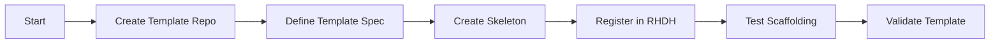

# Golden Paths Agent

## Task
Manage software templates (Golden Paths) for developer self-service.

## Skills Reference
- **[rhdh-portal](../../skills/rhdh-portal/)** - Template configuration
- **[github-cli](../../skills/github-cli/)** - Repository operations
- **[validation-scripts](../../skills/validation-scripts/)** - Template validation

## Workflow



## Commands

### Register Template
```bash
# Add template location to app-config
cat >> app-config-rhdh.yaml <<EOF
catalog:
  locations:
    - type: url
      target: https://github.com/${ORG}/golden-paths/blob/main/templates/*/template.yaml
EOF
```

### Validate Template
```bash
# Dry-run scaffolding
backstage-cli template validate ./template.yaml
```

## Template Structure
```
golden-paths/
├── h1-foundation/
│   └── infrastructure-template/
│       ├── template.yaml
│       └── skeleton/
├── h2-enhancement/
│   └── microservice-template/
│       ├── template.yaml
│       └── skeleton/
└── h3-innovation/
    └── ai-agent-template/
        ├── template.yaml
        └── skeleton/
```

## Parameters

| Parameter | Required | Default | Description |
|-----------|----------|---------|-------------|
| template_name | Yes | - | Template identifier |
| template_horizon | Yes | - | H1, H2, or H3 |
| target_repo | Yes | - | GitHub organization |

## Dependencies
- `rhdh-portal-agent` (Developer Hub)

## Triggers Next
- Developer self-service via RHDH portal
