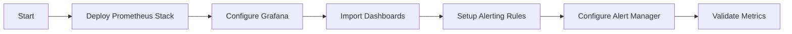

# Observability Agent

## Task
Deploy and configure observability stack (Prometheus, Grafana, alerting).

## Skills Reference
- **[observability-stack](../../skills/observability-stack/)** - Monitoring deployment
- **[helm-cli](../../skills/helm-cli/)** - Helm chart management
- **[kubectl-cli](../../skills/kubectl-cli/)** - Kubernetes operations
- **[validation-scripts](../../skills/validation-scripts/)** - Monitoring validation

## Workflow



## Commands

### Deploy via Helm
```bash
helm repo add prometheus-community https://prometheus-community.github.io/helm-charts
helm repo update

helm upgrade --install monitoring prometheus-community/kube-prometheus-stack \
  --namespace monitoring --create-namespace \
  -f deploy/helm/monitoring/values.yaml
```

### OpenShift User Workload Monitoring
```bash
oc apply -f - <<EOF
apiVersion: v1
kind: ConfigMap
metadata:
  name: cluster-monitoring-config
  namespace: openshift-monitoring
data:
  config.yaml: |
    enableUserWorkload: true
EOF
```

### Import Dashboards
```bash
kubectl apply -f grafana/dashboards/
```

### Validate
```bash
kubectl get pods -n monitoring
./scripts/validate-deployment.sh --component monitoring
```

## Parameters

| Parameter | Required | Default | Description |
|-----------|----------|---------|-------------|
| platform | Yes | - | aks or aro |
| retention_days | No | 15 | Prometheus retention |
| enable_alerts | No | true | Enable alerting |

## Dependencies
- `infrastructure-agent` or `aro-platform-agent` (cluster)

## Triggers Next
- `sre-agent` (SRE automation workflows)
