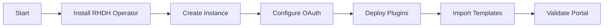

# RHDH Portal Agent

## Task
Deploy and configure Red Hat Developer Hub (Backstage-based IDP).

## Skills Reference
- **[rhdh-portal](../../skills/rhdh-portal/)** - RHDH configuration
- **[openshift-operations](../../skills/openshift-operations/)** - OpenShift management
- **[helm-cli](../../skills/helm-cli/)** - Helm chart management
- **[validation-scripts](../../skills/validation-scripts/)** - Portal validation

## Workflow



## Commands

### Install RHDH Operator
```bash
oc apply -f - <<EOF
apiVersion: operators.coreos.com/v1alpha1
kind: Subscription
metadata:
  name: rhdh-operator
  namespace: openshift-operators
spec:
  channel: fast-1.5
  name: rhdh
  source: redhat-operators
  sourceNamespace: openshift-marketplace
EOF
```

### Create RHDH Instance
```bash
oc create namespace rhdh

oc apply -f - <<EOF
apiVersion: rhdh.redhat.com/v1alpha3
kind: Backstage
metadata:
  name: developer-hub
  namespace: rhdh
spec:
  application:
    appConfig:
      configMaps:
        - name: app-config-rhdh
    extraEnvs:
      secrets:
        - name: rhdh-secrets
EOF
```

### Validate
```bash
oc get backstage -n rhdh
oc get route -n rhdh
./scripts/validate-deployment.sh --component rhdh
```

## Parameters

| Parameter | Required | Default | Description |
|-----------|----------|---------|-------------|
| namespace | No | rhdh | RHDH namespace |
| oauth_provider | No | github | OAuth provider |
| enable_techdocs | No | true | Enable TechDocs |

## Dependencies
- `aro-platform-agent` (OpenShift cluster)
- `database-agent` (PostgreSQL for RHDH)

## Triggers Next
- `golden-paths-agent` (Software templates)
