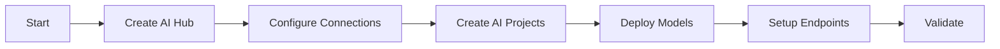

# AI Foundry Agent

## Task
Deploy and configure Azure AI Foundry (Hub + Projects) for AI/ML workloads.

## Skills Reference
- **[ai-foundry-operations](../../skills/ai-foundry-operations/)** - AI Foundry management
- **[azure-infrastructure](../../skills/azure-infrastructure/)** - Resource provisioning
- **[terraform-cli](../../skills/terraform-cli/)** - Infrastructure as code
- **[validation-scripts](../../skills/validation-scripts/)** - AI validation

## Workflow



## Commands

### Deploy AI Hub
```bash
cd terraform/environments/${ENV}
terraform plan -target=module.ai_foundry -out=ai.tfplan
terraform apply ai.tfplan
```

### Create AI Project (CLI)
```bash
az ml workspace create \
  --name ${PROJECT_NAME} \
  --resource-group ${RESOURCE_GROUP} \
  --hub-id ${AI_HUB_ID}
```

### Deploy Model
```bash
az ml online-deployment create \
  --name ${DEPLOYMENT_NAME} \
  --endpoint-name ${ENDPOINT_NAME} \
  --file deployment.yaml
```

### Validate
```bash
az ml workspace show -n ${PROJECT_NAME} -g ${RG}
./scripts/validate-deployment.sh --component ai-foundry
```

## Parameters

| Parameter | Required | Default | Description |
|-----------|----------|---------|-------------|
| environment | Yes | - | dev, staging, prod |
| hub_name | Yes | - | AI Hub name |
| enable_private | No | true | Private networking |
| models | No | [] | Models to deploy |

## Dependencies
- `networking-agent` (Private endpoints)
- `security-agent` (Key Vault, identities)
- `purview-governance-agent` (Data governance)

## Triggers Next
- `mlops-pipeline-agent` (ML pipelines)
