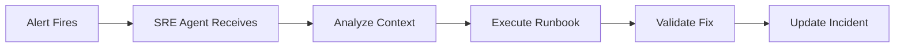

# SRE Agent Setup

## Task
Configure AI-powered SRE agents for automated incident response.

## Skills Reference
- **[ai-foundry-operations](../../skills/ai-foundry-operations/)** - AI agent setup
- **[observability-stack](../../skills/observability-stack/)** - Monitoring integration
- **[kubectl-cli](../../skills/kubectl-cli/)** - Kubernetes operations
- **[validation-scripts](../../skills/validation-scripts/)** - SRE validation

## Workflow



## SRE Agent Capabilities

### Incident Analysis
- Query Prometheus metrics
- Analyze logs in Grafana Loki
- Correlate with recent deployments

### Automated Response
- Execute predefined runbooks
- Scale deployments
- Restart unhealthy pods
- Trigger rollbacks

### Communication
- Update incident channels
- Create post-mortems
- Document actions taken

## Configuration Example
```yaml
sre_agent:
  name: platform-sre
  integrations:
    - prometheus
    - alertmanager
    - grafana
    - pagerduty
  runbooks:
    - high-cpu-usage
    - memory-pressure
    - pod-crashloop
    - deployment-failed
  permissions:
    - read: all-namespaces
    - write: platform-namespaces
```

## Parameters

| Parameter | Required | Default | Description |
|-----------|----------|---------|-------------|
| agent_name | Yes | - | SRE agent name |
| integrations | Yes | - | Monitoring integrations |
| auto_remediate | No | false | Enable auto-fix |

## Dependencies
- `ai-foundry-agent` (AI capabilities)
- `observability-agent` (Monitoring stack)

## Triggers Next
- Automated incident response
