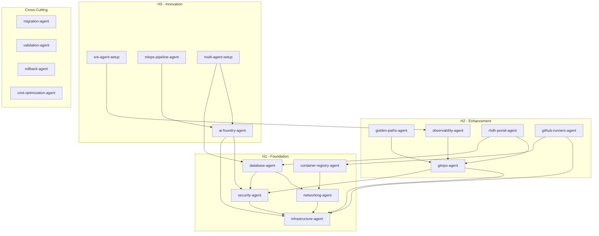

# Three Horizons Accelerator - Agent Catalog

## 📚 Complete Agent Reference

This catalog documents all agents available in the Three Horizons Accelerator Agent Kit.

---

## 🗂️ Agent Index

### H1 - Foundation (8 Agents)

| Agent | Purpose | Complexity |
|-------|---------|------------|
| [infrastructure-agent](agents/h1-foundation/infrastructure-agent.md) | AKS, networking, Key Vault, identities | High |
| [networking-agent](agents/h1-foundation/networking-agent.md) | VNets, subnets, NSGs, private endpoints | Medium |
| [security-agent](agents/h1-foundation/security-agent.md) | Workload Identity, RBAC, policies, Defender | Medium |
| [container-registry-agent](agents/h1-foundation/container-registry-agent.md) | ACR setup, geo-replication, AKS attach | Low |
| [database-agent](agents/h1-foundation/database-agent.md) | PostgreSQL, Redis, Cosmos DB | Medium |
| [defender-cloud-agent](agents/h1-foundation/defender-cloud-agent.md) | Defender for Cloud, CSPM, container scanning | Medium |
| [purview-governance-agent](agents/h1-foundation/purview-governance-agent.md) | Data governance, LATAM classifications | Medium |
| [aro-platform-agent](agents/h1-foundation/aro-platform-agent.md) | Azure Red Hat OpenShift deployment | High |

### H2 - Enhancement (5 Agents)

| Agent | Purpose | Complexity |
|-------|---------|------------|
| [gitops-agent](agents/h2-enhancement/gitops-agent.md) | ArgoCD, GitOps workflows, app deployment | Medium |
| [golden-paths-agent](agents/h2-enhancement/golden-paths-agent.md) | Templates, scaffolding, RHDH catalog | Medium |
| [observability-agent](agents/h2-enhancement/observability-agent.md) | Prometheus, Grafana, Alertmanager, Loki | Medium |
| [rhdh-portal-agent](agents/h2-enhancement/rhdh-portal-agent.md) | Red Hat Developer Hub, IDP | High |
| [github-runners-agent](agents/h2-enhancement/github-runners-agent.md) | Self-hosted runners on AKS | Medium |

### H3 - Innovation (4 Agents)

| Agent | Purpose | Complexity |
|-------|---------|------------|
| [ai-foundry-agent](agents/h3-innovation/ai-foundry-agent.md) | Azure AI Foundry, models, RAG, agents | High |
| [sre-agent-setup](agents/h3-innovation/sre-agent-setup.md) | Azure SRE Agent, auto-remediation | Medium |
| [mlops-pipeline-agent](agents/h3-innovation/mlops-pipeline-agent.md) | Azure ML, MLflow, model deployment | High |
| [multi-agent-setup](agents/h3-innovation/multi-agent-setup.md) | AutoGen, Semantic Kernel, agent teams | High |

### Cross-Cutting (6 Agents)

| Agent | Purpose | Complexity |
|-------|---------|------------|
| [migration-agent](agents/cross-cutting/migration-agent.md) | ADO → GitHub migration | High |
| [validation-agent](agents/cross-cutting/validation-agent.md) | Health checks, compliance, audits | Medium |
| [rollback-agent](agents/cross-cutting/rollback-agent.md) | Emergency rollback procedures | Medium |
| [cost-optimization-agent](agents/cross-cutting/cost-optimization-agent.md) | FinOps, cost analysis, optimization | Low |
| [github-app-agent](agents/cross-cutting/github-app-agent.md) | GitHub App setup and configuration | Medium |
| [identity-federation-agent](agents/cross-cutting/identity-federation-agent.md) | Workload Identity Federation setup | Medium |

---

## 🏷️ Label Reference

### Agent Labels (Primary Trigger)

| Label | Agent |
|-------|-------|
| `agent:infrastructure` | infrastructure-agent |
| `agent:networking` | networking-agent |
| `agent:security` | security-agent |
| `agent:acr` | container-registry-agent |
| `agent:database` | database-agent |
| `agent:defender` | defender-cloud-agent |
| `agent:purview` | purview-governance-agent |
| `agent:aro` | aro-platform-agent |
| `agent:gitops` | gitops-agent |
| `agent:golden-paths` | golden-paths-agent |
| `agent:observability` | observability-agent |
| `agent:rhdh` | rhdh-portal-agent |
| `agent:github-runners` | github-runners-agent |
| `agent:ai-foundry` | ai-foundry-agent |
| `agent:sre-agent` | sre-agent-setup |
| `agent:mlops` | mlops-pipeline-agent |
| `agent:multi-agent` | multi-agent-setup |
| `agent:migration` | migration-agent |
| `agent:validation` | validation-agent |
| `agent:rollback` | rollback-agent |
| `agent:cost-optimization` | cost-optimization-agent |
| `agent:github-app` | github-app-agent |
| `agent:identity-federation` | identity-federation-agent |

### Horizon Labels

| Label | Scope |
|-------|-------|
| `horizon:h1` | Foundation agents |
| `horizon:h2` | Enhancement agents |
| `horizon:h3` | Innovation agents |
| `horizon:cross` | Cross-cutting agents |

### Environment Labels

| Label | Approval Required |
|-------|-------------------|
| `env:dev` | No |
| `env:staging` | Yes (platform-team) |
| `env:prod` | Yes (platform-leads + security) |

### Priority Labels

| Label | Processing Order |
|-------|------------------|
| `priority:critical` | Immediate |
| `priority:high` | Next in queue |
| `priority:normal` | Standard |
| `priority:low` | When available |

### Workflow Labels (Multi-Agent)

| Label | Workflow |
|-------|----------|
| `workflow:full-deployment` | Complete H1 → H2 → H3 |
| `workflow:h1-only` | Foundation only |
| `workflow:h2-only` | Enhancement only |
| `workflow:h3-only` | Innovation only |
| `workflow:migration` | ADO → GitHub |

---

## 🔧 MCP Server Requirements

| Agent | azure | terraform | kubernetes | helm | argocd | github | azure-devops | azure-ai | prometheus |
|-------|-------|-----------|------------|------|--------|--------|--------------|----------|------------|
| infrastructure | ✅ | ✅ | ✅ | — | — | ✅ | — | — | — |
| networking | ✅ | ○ | — | — | — | ✅ | — | — | — |
| security | ✅ | ○ | ✅ | — | — | ✅ | — | — | — |
| container-registry | ✅ | — | ✅ | — | — | ✅ | — | — | — |
| database | ✅ | — | ✅ | — | — | ✅ | — | — | — |
| gitops | — | — | ✅ | ✅ | ✅ | ✅ | — | — | — |
| golden-paths | — | — | ✅ | — | ✅ | ✅ | — | — | — |
| observability | — | — | ✅ | ✅ | — | ✅ | — | — | ○ |
| rhdh-portal | — | — | ✅ | ✅ | ✅ | ✅ | — | — | — |
| github-runners | — | — | ✅ | ✅ | — | ✅ | — | — | — |
| ai-foundry | ✅ | — | ✅ | — | — | ✅ | — | ✅ | — |
| sre-agent | ✅ | — | ✅ | — | — | ✅ | — | — | — |
| mlops | ✅ | — | ✅ | — | — | ✅ | — | — | — |
| multi-agent | ✅ | — | ✅ | — | — | ✅ | — | ✅ | — |
| migration | ✅ | — | — | — | — | ✅ | ✅ | — | — |
| validation | ✅ | ✅ | ✅ | — | ✅ | ✅ | — | — | ○ |
| rollback | — | ✅ | ✅ | ✅ | ✅ | ✅ | — | — | — |
| cost-optimization | ✅ | — | ✅ | — | — | ✅ | — | — | — |

✅ = Required | ○ = Optional | — = Not used

---

## 🔗 Agent Dependencies



---

## ⏱️ Typical Execution Times

| Agent | Simple | Standard | Complex |
|-------|--------|----------|---------|
| infrastructure-agent | 15 min | 25 min | 45 min |
| networking-agent | 5 min | 10 min | 20 min |
| security-agent | 10 min | 15 min | 30 min |
| container-registry-agent | 5 min | 10 min | 15 min |
| database-agent | 10 min | 20 min | 35 min |
| gitops-agent | 10 min | 15 min | 25 min |
| golden-paths-agent | 5 min | 10 min | 20 min |
| observability-agent | 10 min | 15 min | 25 min |
| rhdh-portal-agent | 15 min | 25 min | 40 min |
| github-runners-agent | 10 min | 15 min | 25 min |
| ai-foundry-agent | 15 min | 30 min | 60 min |
| sre-agent-setup | 10 min | 15 min | 25 min |
| mlops-pipeline-agent | 15 min | 30 min | 60 min |
| multi-agent-setup | 15 min | 25 min | 45 min |
| migration-agent | 30 min | 2 hours | 8 hours |
| validation-agent | 5 min | 10 min | 30 min |
| rollback-agent | 2 min | 5 min | 15 min |
| cost-optimization-agent | 5 min | 10 min | 20 min |

---

## 🚀 Quick Start Examples

### Deploy H1 Foundation

```markdown
---
title: "[H1] Infrastructure Setup - MyProject"
labels: agent:infrastructure, horizon:h1, env:dev, priority:high
---

## Configuration
See infrastructure-agent issue template for full config.
```

### Deploy H2 Enhancement

```markdown
---
title: "[H2] GitOps Setup - MyProject"
labels: agent:gitops, horizon:h2, env:dev
---

## Prerequisites
- Issue #1 (infrastructure) ✅ Complete

## Configuration
See gitops-agent issue template.
```

### Deploy H3 Innovation

```markdown
---
title: "[H3] AI Foundry Setup - MyProject"
labels: agent:ai-foundry, horizon:h3, env:dev
---

## Prerequisites
- Issue #1 (infrastructure) ✅ Complete
- Issue #2 (security) ✅ Complete

## Configuration
See ai-foundry-agent issue template.
```

### Full Platform Deployment

```markdown
---
title: "[Workflow] Full Three Horizons Deployment"
labels: workflow:full-deployment, env:dev, priority:high
---

## Project Configuration
See .github/ISSUE_TEMPLATE/full-deployment.yml
```

---

## 📁 Repository Structure

```
accelerator-agents/
├── README.md                      # Main documentation
├── AGENT_CATALOG.md              # This file
├── agents/
│   ├── h1-foundation/
│   │   ├── infrastructure-agent.md
│   │   ├── networking-agent.md
│   │   ├── security-agent.md
│   │   ├── container-registry-agent.md
│   │   └── database-agent.md
│   ├── h2-enhancement/
│   │   ├── gitops-agent.md
│   │   ├── golden-paths-agent.md
│   │   ├── observability-agent.md
│   │   ├── rhdh-portal-agent.md
│   │   └── github-runners-agent.md
│   ├── h3-innovation/
│   │   ├── ai-foundry-agent.md
│   │   ├── sre-agent-setup.md
│   │   ├── mlops-pipeline-agent.md
│   │   └── multi-agent-setup.md
│   └── cross-cutting/
│       ├── migration-agent.md
│       ├── validation-agent.md
│       ├── rollback-agent.md
│       └── cost-optimization-agent.md
├── orchestrator/
│   └── agent-router.md
├── mcp-servers/
│   └── mcp-config.json
└── .github/
    ├── workflows/
    │   └── agent-router.yml
    └── ISSUE_TEMPLATE/
        ├── full-deployment.yml
        └── infrastructure.yml
```

---

## 📊 Agent Statistics

| Metric | Value |
|--------|-------|
| Total Agents | 23 |
| H1 Foundation | 8 |
| H2 Enhancement | 5 |
| H3 Innovation | 4 |
| Cross-Cutting | 6 |
| MCP Servers Used | 15 |
| Total Capabilities | 150+ |

---

## 🔄 Version History

| Version | Date | Changes |
|---------|------|---------|
| 1.0.0 | 2024-12-10 | Initial release with 18 agents |
| 2.0.0 | 2025-12-10 | Added 5 new agents: defender-cloud, purview-governance, aro-platform, github-app, identity-federation |

---

**Catalog Version:** 2.0.0
**Last Updated:** December 2025
