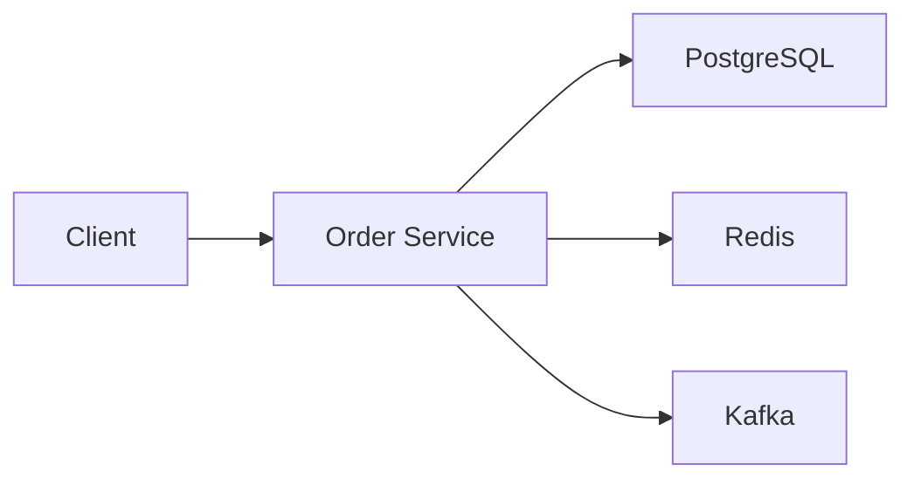
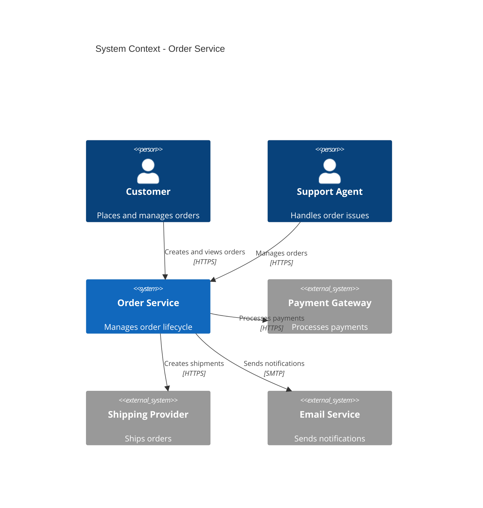
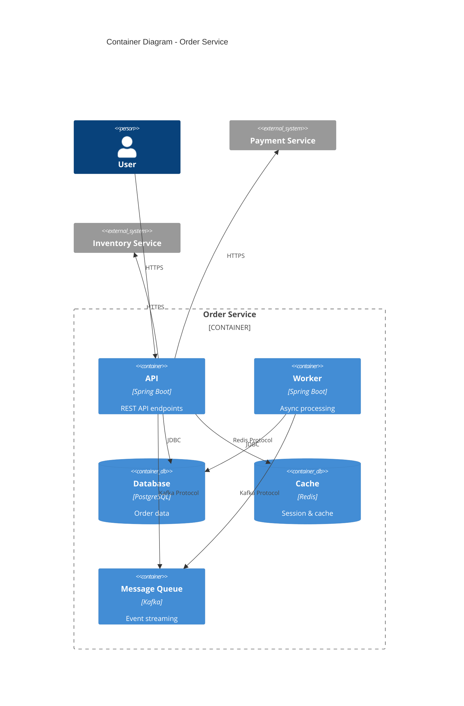
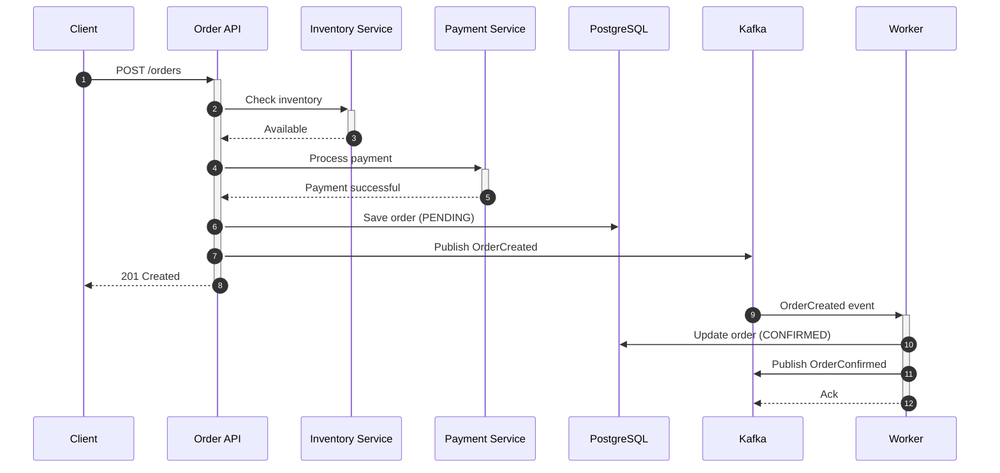
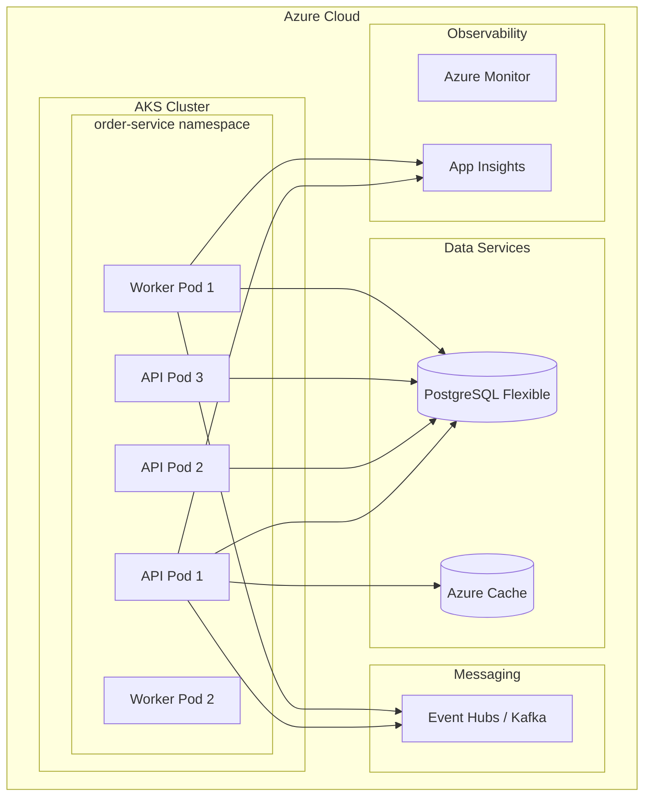

# Golden Path Section 15: TechDocs

## Documentation as Code with RHDH Integration

**Version:** 2.0  
**Parent Document:** golden_path_end_to_end_guide_v2_complete.md  
**Author:** paulasilva@microsoft.com  
**Last Updated:** December 2025

---

## Table of Contents

1. [Overview](#1-overview)
2. [TechDocs Architecture](#2-techdocs-architecture)
3. [Documentation Standards](#3-documentation-standards)
4. [MkDocs Configuration](#4-mkdocs-configuration)
5. [API Documentation](#5-api-documentation)
6. [Architecture Diagrams](#6-architecture-diagrams)
7. [Runbook Documentation](#7-runbook-documentation)
8. [Architecture Decision Records](#8-architecture-decision-records)
9. [Auto-Generation Workflows](#9-auto-generation-workflows)
10. [RHDH Integration](#10-rhdh-integration)

---

## 1. Overview

### TechDocs Philosophy

```
┌─────────────────────────────────────────────────────────────────────────────┐
│                    TECHDOCS PHILOSOPHY                                       │
├─────────────────────────────────────────────────────────────────────────────┤
│                                                                             │
│  "Documentation lives with the code"                                        │
│                                                                             │
│  ┌─────────────────────────────────────────────────────────────────────┐   │
│  │                         PRINCIPLES                                   │   │
│  │                                                                       │   │
│  │  1. DISCOVERABLE    - All docs accessible from RHDH catalog         │   │
│  │  2. MAINTAINABLE    - Docs update with code changes                 │   │
│  │  3. AUTOMATED       - AI-assisted generation and updates            │   │
│  │  4. VERSIONED       - Docs follow code versions                     │   │
│  │  5. SEARCHABLE      - Full-text search across all services          │   │
│  │                                                                       │   │
│  └─────────────────────────────────────────────────────────────────────┘   │
│                                                                             │
│  ┌─────────────────────────────────────────────────────────────────────┐   │
│  │                         DOC TYPES                                    │   │
│  │                                                                       │   │
│  │  ┌──────────┐  ┌──────────┐  ┌──────────┐  ┌──────────┐            │   │
│  │  │   API    │  │ Runbooks │  │   ADRs   │  │Tutorials │            │   │
│  │  │   Docs   │  │          │  │          │  │          │            │   │
│  │  └────┬─────┘  └────┬─────┘  └────┬─────┘  └────┬─────┘            │   │
│  │       │             │             │             │                    │   │
│  │       └─────────────┼─────────────┼─────────────┘                    │   │
│  │                     ▼                                                │   │
│  │              ┌──────────────┐                                        │   │
│  │              │   TechDocs   │                                        │   │
│  │              │   (MkDocs)   │                                        │   │
│  │              └──────┬───────┘                                        │   │
│  │                     │                                                │   │
│  │                     ▼                                                │   │
│  │              ┌──────────────┐                                        │   │
│  │              │     RHDH     │                                        │   │
│  │              │   Catalog    │                                        │   │
│  │              └──────────────┘                                        │   │
│  │                                                                       │   │
│  └─────────────────────────────────────────────────────────────────────┘   │
│                                                                             │
└─────────────────────────────────────────────────────────────────────────────┘
```

### Documentation Structure

```
docs/
├── index.md                    # Service overview
├── getting-started.md          # Quick start guide
├── architecture/
│   ├── overview.md            # Architecture overview
│   ├── diagrams.md            # System diagrams
│   └── decisions/             # ADRs
│       ├── 0001-use-postgresql.md
│       ├── 0002-event-driven.md
│       └── template.md
├── api/
│   ├── overview.md            # API overview
│   ├── openapi.yaml           # OpenAPI spec
│   └── endpoints/             # Endpoint details
│       ├── orders.md
│       └── users.md
├── development/
│   ├── setup.md               # Dev environment
│   ├── testing.md             # Testing guide
│   └── contributing.md        # Contribution guide
├── operations/
│   ├── deployment.md          # Deployment guide
│   ├── monitoring.md          # Monitoring guide
│   └── runbooks/              # Operational runbooks
│       ├── high-error-rate.md
│       ├── high-latency.md
│       └── database-failover.md
└── mkdocs.yml                 # MkDocs configuration
```

---

## 2. TechDocs Architecture

### Build Pipeline

```yaml
# .github/workflows/techdocs.yml
name: TechDocs Build

on:
  push:
    branches: [main]
    paths:
      - 'docs/**'
      - 'mkdocs.yml'
      - 'src/**/*.java'  # Trigger on code changes for API docs
      - 'openapi.yaml'
      
  pull_request:
    paths:
      - 'docs/**'
      - 'mkdocs.yml'

jobs:
  build:
    runs-on: ubuntu-latest
    
    steps:
      - name: Checkout
        uses: actions/checkout@v4
        
      - name: Setup Python
        uses: actions/setup-python@v5
        with:
          python-version: '3.11'
          
      - name: Install dependencies
        run: |
          pip install mkdocs-techdocs-core
          pip install mkdocs-material
          pip install mkdocs-mermaid2-plugin
          pip install mkdocs-git-revision-date-localized-plugin
          pip install mkdocs-minify-plugin
          pip install mkdocs-redirects
          
      - name: Generate API docs
        run: |
          # Generate OpenAPI documentation
          npx @redocly/cli build-docs openapi.yaml -o docs/api/reference.html
          
      - name: Build TechDocs
        run: |
          mkdocs build --strict --site-dir site
          
      - name: Validate links
        run: |
          pip install linkchecker
          linkchecker site/index.html --check-extern
          
      - name: Upload to Azure Blob
        if: github.ref == 'refs/heads/main'
        uses: azure/cli@v1
        with:
          inlineScript: |
            az storage blob upload-batch \
              --account-name ${{ secrets.TECHDOCS_STORAGE_ACCOUNT }} \
              --destination techdocs \
              --source site \
              --destination-path order-service/default/order-service \
              --overwrite
              
      - name: Notify RHDH
        if: github.ref == 'refs/heads/main'
        run: |
          curl -X POST "${{ secrets.RHDH_URL }}/api/techdocs/sync" \
            -H "Authorization: Bearer ${{ secrets.RHDH_TOKEN }}" \
            -H "Content-Type: application/json" \
            -d '{"entity": "component:default/order-service"}'
```

### Azure Blob Storage Configuration

```terraform
# terraform/modules/techdocs/main.tf
resource "azurerm_storage_account" "techdocs" {
  name                     = "techdocs${var.environment}"
  resource_group_name      = var.resource_group_name
  location                 = var.location
  account_tier             = "Standard"
  account_replication_type = "GRS"
  
  static_website {
    index_document     = "index.html"
    error_404_document = "404.html"
  }
  
  blob_properties {
    cors_rule {
      allowed_headers    = ["*"]
      allowed_methods    = ["GET", "HEAD"]
      allowed_origins    = ["https://rhdh.example.com"]
      exposed_headers    = ["*"]
      max_age_in_seconds = 3600
    }
  }
}

resource "azurerm_storage_container" "techdocs" {
  name                  = "techdocs"
  storage_account_name  = azurerm_storage_account.techdocs.name
  container_access_type = "blob"
}

resource "azurerm_cdn_profile" "techdocs" {
  name                = "techdocs-cdn"
  location            = "global"
  resource_group_name = var.resource_group_name
  sku                 = "Standard_Microsoft"
}

resource "azurerm_cdn_endpoint" "techdocs" {
  name                = "techdocs"
  profile_name        = azurerm_cdn_profile.techdocs.name
  location            = "global"
  resource_group_name = var.resource_group_name
  
  origin {
    name      = "techdocs-blob"
    host_name = azurerm_storage_account.techdocs.primary_blob_host
  }
  
  origin_host_header = azurerm_storage_account.techdocs.primary_blob_host
}
```

---

## 3. Documentation Standards

### Writing Guidelines

```markdown
<!-- docs/STYLE_GUIDE.md -->
# Documentation Style Guide

## General Principles

1. **Be concise** - Respect the reader's time
2. **Be specific** - Use concrete examples
3. **Be current** - Keep docs up to date
4. **Be accessible** - Write for all skill levels

## Formatting Standards

### Headings
- Use sentence case: "Getting started" not "Getting Started"
- Limit to 3 levels (##, ###, ####)
- Include a blank line before and after

### Code Blocks
- Always specify the language
- Keep examples runnable and tested
- Include comments for complex logic

```java
// Example: Creating an order
Order order = orderService.createOrder(
    CreateOrderRequest.builder()
        .userId(userId)
        .items(items)
        .build()
);
```

### Links
- Use relative links within the same repo
- Use descriptive link text (not "click here")
- Verify all links work

### Admonitions
Use these for important information:

!!! note
    For additional context or tips.

!!! warning
    For potential pitfalls or gotchas.

!!! danger
    For security concerns or breaking changes.

## Content Requirements

### Every Service Must Have
1. Overview (what it does, why it exists)
2. Getting Started (5-minute quickstart)
3. API Reference (generated from OpenAPI)
4. Architecture (diagrams, decisions)
5. Operations (deployment, monitoring, runbooks)

### API Documentation
- Document all endpoints
- Include request/response examples
- Document error codes
- Provide authentication details
```

### Documentation Templates

```markdown
<!-- docs/templates/service-overview.md -->
# {Service Name}

> One-line description of the service

## Overview

Brief description of what the service does and its role in the system.

## Key Features

- Feature 1: Description
- Feature 2: Description
- Feature 3: Description

## Architecture



## Getting Started

### Prerequisites
- Requirement 1
- Requirement 2

### Quick Start

```bash
# Clone the repository
git clone https://github.com/org/order-service.git

# Start dependencies
docker-compose up -d

# Run the service
./mvnw spring-boot:run
```

## API Reference

See [API Documentation](./api/overview.md) for complete API reference.

## Related Services

| Service | Relationship | Link |
|---------|--------------|------|
| Payment Service | Downstream | [Docs](../payment-service/) |
| Inventory Service | Downstream | [Docs](../inventory-service/) |

## Team

- **Owner**: @platform-team
- **Slack**: #order-service
- **On-Call**: [PagerDuty](https://pagerduty.com/services/order-service)
```

---

## 4. MkDocs Configuration

### Complete mkdocs.yml

```yaml
# mkdocs.yml
site_name: Order Service
site_description: Order management microservice documentation
site_url: https://techdocs.example.com/order-service
repo_url: https://github.com/org/order-service
repo_name: org/order-service
edit_uri: edit/main/docs/

# Theme configuration
theme:
  name: material
  custom_dir: docs/overrides
  palette:
    - scheme: default
      primary: indigo
      accent: indigo
      toggle:
        icon: material/brightness-7
        name: Switch to dark mode
    - scheme: slate
      primary: indigo
      accent: indigo
      toggle:
        icon: material/brightness-4
        name: Switch to light mode
  features:
    - navigation.instant
    - navigation.tracking
    - navigation.tabs
    - navigation.sections
    - navigation.expand
    - navigation.indexes
    - toc.integrate
    - search.suggest
    - search.highlight
    - content.tabs.link
    - content.code.annotate
    - content.code.copy
  icon:
    repo: fontawesome/brands/github

# Extensions
markdown_extensions:
  - abbr
  - admonition
  - attr_list
  - def_list
  - footnotes
  - meta
  - md_in_html
  - toc:
      permalink: true
      toc_depth: 3
  - pymdownx.arithmatex:
      generic: true
  - pymdownx.betterem:
      smart_enable: all
  - pymdownx.caret
  - pymdownx.details
  - pymdownx.emoji:
      emoji_index: !!python/name:materialx.emoji.twemoji
      emoji_generator: !!python/name:materialx.emoji.to_svg
  - pymdownx.highlight:
      anchor_linenums: true
  - pymdownx.inlinehilite
  - pymdownx.keys
  - pymdownx.magiclink:
      repo_url_shorthand: true
      user: org
      repo: order-service
  - pymdownx.mark
  - pymdownx.smartsymbols
  - pymdownx.superfences:
      custom_fences:
        - name: mermaid
          class: mermaid
          format: !!python/name:pymdownx.superfences.fence_code_format
  - pymdownx.tabbed:
      alternate_style: true
  - pymdownx.tasklist:
      custom_checkbox: true
  - pymdownx.tilde

# Plugins
plugins:
  - search:
      separator: '[\s\-,:!=\[\]()"`/]+|\.(?!\d)|&[lg]t;|(?!\b)(?=[A-Z][a-z])'
  - git-revision-date-localized:
      enable_creation_date: true
      type: timeago
  - minify:
      minify_html: true
  - mermaid2
  - redirects:
      redirect_maps:
        'old-page.md': 'new-page.md'

# Navigation
nav:
  - Home: index.md
  - Getting Started:
    - Quick Start: getting-started.md
    - Installation: installation.md
    - Configuration: configuration.md
  - Architecture:
    - Overview: architecture/overview.md
    - Diagrams: architecture/diagrams.md
    - Decisions:
      - architecture/decisions/index.md
      - ADR-001 PostgreSQL: architecture/decisions/0001-use-postgresql.md
      - ADR-002 Event-Driven: architecture/decisions/0002-event-driven.md
  - API:
    - Overview: api/overview.md
    - Authentication: api/authentication.md
    - Endpoints:
      - Orders: api/endpoints/orders.md
      - Users: api/endpoints/users.md
    - Errors: api/errors.md
  - Development:
    - Setup: development/setup.md
    - Testing: development/testing.md
    - Contributing: development/contributing.md
  - Operations:
    - Deployment: operations/deployment.md
    - Monitoring: operations/monitoring.md
    - Runbooks:
      - operations/runbooks/index.md
      - High Error Rate: operations/runbooks/high-error-rate.md
      - High Latency: operations/runbooks/high-latency.md

# Extra configuration
extra:
  version:
    provider: mike
  social:
    - icon: fontawesome/brands/github
      link: https://github.com/org
    - icon: fontawesome/brands/slack
      link: https://org.slack.com/archives/order-service
  analytics:
    provider: google
    property: G-XXXXXXXXXX

# Copyright
copyright: Copyright &copy; 2024-2025 Example Corp
```

---

## 5. API Documentation

### OpenAPI Specification

```yaml
# openapi.yaml
openapi: 3.1.0
info:
  title: Order Service API
  description: |
    REST API for managing orders in the e-commerce platform.
    
    ## Authentication
    All endpoints require a valid JWT token in the Authorization header.
    
    ## Rate Limiting
    - Standard: 100 requests/minute
    - Premium: 1000 requests/minute
    
  version: 1.0.0
  contact:
    name: Platform Team
    email: platform@example.com
  license:
    name: MIT
    url: https://opensource.org/licenses/MIT

servers:
  - url: https://api.example.com/v1
    description: Production
  - url: https://staging-api.example.com/v1
    description: Staging
  - url: http://localhost:8080/v1
    description: Local development

tags:
  - name: Orders
    description: Order management operations
  - name: Users
    description: User order history

paths:
  /orders:
    get:
      tags: [Orders]
      summary: List orders
      description: Retrieve a paginated list of orders
      operationId: listOrders
      parameters:
        - name: page
          in: query
          schema:
            type: integer
            default: 0
        - name: size
          in: query
          schema:
            type: integer
            default: 20
            maximum: 100
        - name: status
          in: query
          schema:
            $ref: '#/components/schemas/OrderStatus'
        - name: fromDate
          in: query
          schema:
            type: string
            format: date
        - name: toDate
          in: query
          schema:
            type: string
            format: date
      responses:
        '200':
          description: Successful response
          content:
            application/json:
              schema:
                $ref: '#/components/schemas/OrderPage'
        '401':
          $ref: '#/components/responses/Unauthorized'
        '500':
          $ref: '#/components/responses/InternalError'
          
    post:
      tags: [Orders]
      summary: Create order
      description: Create a new order from cart items
      operationId: createOrder
      requestBody:
        required: true
        content:
          application/json:
            schema:
              $ref: '#/components/schemas/CreateOrderRequest'
            examples:
              basic:
                summary: Basic order
                value:
                  userId: "550e8400-e29b-41d4-a716-446655440000"
                  items:
                    - productId: "prod-001"
                      quantity: 2
                    - productId: "prod-002"
                      quantity: 1
              withShipping:
                summary: Order with shipping
                value:
                  userId: "550e8400-e29b-41d4-a716-446655440000"
                  items:
                    - productId: "prod-001"
                      quantity: 1
                  shippingAddress:
                    street: "123 Main St"
                    city: "Seattle"
                    state: "WA"
                    zipCode: "98101"
      responses:
        '201':
          description: Order created
          content:
            application/json:
              schema:
                $ref: '#/components/schemas/Order'
        '400':
          $ref: '#/components/responses/BadRequest'
        '401':
          $ref: '#/components/responses/Unauthorized'
        '422':
          $ref: '#/components/responses/UnprocessableEntity'
        '500':
          $ref: '#/components/responses/InternalError'

  /orders/{orderId}:
    get:
      tags: [Orders]
      summary: Get order
      description: Retrieve a specific order by ID
      operationId: getOrder
      parameters:
        - name: orderId
          in: path
          required: true
          schema:
            type: string
            format: uuid
      responses:
        '200':
          description: Successful response
          content:
            application/json:
              schema:
                $ref: '#/components/schemas/Order'
        '404':
          $ref: '#/components/responses/NotFound'

components:
  schemas:
    Order:
      type: object
      properties:
        id:
          type: string
          format: uuid
        orderNumber:
          type: string
          example: "ORD-2024-001234"
        userId:
          type: string
          format: uuid
        status:
          $ref: '#/components/schemas/OrderStatus'
        items:
          type: array
          items:
            $ref: '#/components/schemas/OrderItem'
        totalAmount:
          type: number
          format: decimal
        createdAt:
          type: string
          format: date-time
        updatedAt:
          type: string
          format: date-time
          
    OrderStatus:
      type: string
      enum:
        - PENDING
        - CONFIRMED
        - PROCESSING
        - SHIPPED
        - DELIVERED
        - CANCELLED
        
    OrderItem:
      type: object
      properties:
        productId:
          type: string
        productName:
          type: string
        quantity:
          type: integer
          minimum: 1
        unitPrice:
          type: number
          format: decimal
        totalPrice:
          type: number
          format: decimal
          
    CreateOrderRequest:
      type: object
      required:
        - userId
        - items
      properties:
        userId:
          type: string
          format: uuid
        items:
          type: array
          minItems: 1
          items:
            type: object
            required:
              - productId
              - quantity
            properties:
              productId:
                type: string
              quantity:
                type: integer
                minimum: 1
        shippingAddress:
          $ref: '#/components/schemas/Address'
          
    Address:
      type: object
      properties:
        street:
          type: string
        city:
          type: string
        state:
          type: string
        zipCode:
          type: string
        country:
          type: string
          default: "US"
          
    Error:
      type: object
      properties:
        code:
          type: string
        message:
          type: string
        details:
          type: array
          items:
            type: object
            properties:
              field:
                type: string
              message:
                type: string

  responses:
    BadRequest:
      description: Bad request
      content:
        application/json:
          schema:
            $ref: '#/components/schemas/Error'
          example:
            code: "BAD_REQUEST"
            message: "Invalid request body"
            
    Unauthorized:
      description: Unauthorized
      content:
        application/json:
          schema:
            $ref: '#/components/schemas/Error'
          example:
            code: "UNAUTHORIZED"
            message: "Invalid or missing authentication token"
            
    NotFound:
      description: Resource not found
      content:
        application/json:
          schema:
            $ref: '#/components/schemas/Error'
          example:
            code: "NOT_FOUND"
            message: "Order not found"
            
    UnprocessableEntity:
      description: Unprocessable entity
      content:
        application/json:
          schema:
            $ref: '#/components/schemas/Error'
          example:
            code: "VALIDATION_ERROR"
            message: "Validation failed"
            details:
              - field: "items[0].quantity"
                message: "must be greater than 0"
                
    InternalError:
      description: Internal server error
      content:
        application/json:
          schema:
            $ref: '#/components/schemas/Error'
          example:
            code: "INTERNAL_ERROR"
            message: "An unexpected error occurred"

  securitySchemes:
    bearerAuth:
      type: http
      scheme: bearer
      bearerFormat: JWT

security:
  - bearerAuth: []
```

---

## 6. Architecture Diagrams

### System Context Diagram

```markdown
<!-- docs/architecture/diagrams.md -->
# Architecture Diagrams

## System Context



## Container Diagram



## Sequence Diagram - Create Order



## Deployment Diagram


```

---

## 7. Runbook Documentation

### Runbook Template

```markdown
<!-- docs/operations/runbooks/template.md -->
# Runbook: {Issue Name}

## Overview

**Severity**: Critical / High / Medium / Low  
**Alert Name**: `{AlertName}`  
**On-Call Team**: Platform Team  
**Escalation**: #sre-escalation

## Symptoms

- Symptom 1
- Symptom 2
- Symptom 3

## Impact

Describe the business and technical impact.

## Prerequisites

- [ ] Access to Kubernetes cluster
- [ ] Access to monitoring dashboards
- [ ] Database credentials (if needed)

## Diagnosis

### Step 1: Check Service Health

```bash
kubectl get pods -n order-service -l app=order-service
kubectl describe pod <pod-name> -n order-service
```

### Step 2: Check Logs

```bash
kubectl logs -n order-service -l app=order-service --tail=100 | grep -i error
```

### Step 3: Check Metrics

- [Grafana Dashboard](https://grafana.example.com/d/order-service)
- Error rate: `rate(http_requests_total{app="order-service",status=~"5.."}[5m])`
- Latency P99: `histogram_quantile(0.99, rate(http_request_duration_seconds_bucket[5m]))`

## Resolution

### Option 1: Restart Pods

```bash
kubectl rollout restart deployment/order-service -n order-service
```

### Option 2: Scale Up

```bash
kubectl scale deployment/order-service --replicas=5 -n order-service
```

### Option 3: Rollback

```bash
kubectl rollout undo deployment/order-service -n order-service
```

## Verification

- [ ] Error rate below 0.1%
- [ ] Latency P99 below 500ms
- [ ] All pods healthy

## Post-Incident

1. Create incident report
2. Schedule post-mortem
3. Update runbook if needed

## References

- [Architecture Docs](../../architecture/overview.md)
- [Monitoring Dashboard](https://grafana.example.com/d/order-service)
- [SLO Dashboard](https://grafana.example.com/d/order-service-slo)
```

### High Error Rate Runbook

```markdown
<!-- docs/operations/runbooks/high-error-rate.md -->
# Runbook: High Error Rate

## Overview

**Severity**: Critical  
**Alert Name**: `OrderServiceHighErrorRate`  
**On-Call Team**: Platform Team  
**Escalation**: #sre-escalation

## Symptoms

- Error rate > 1% sustained for 5+ minutes
- Increased 5xx responses
- Customer complaints about failed orders

## Impact

- Orders cannot be created or updated
- Revenue loss: ~$X per minute
- Customer trust degradation

## Diagnosis

### Step 1: Identify Error Source

```bash
# Check error logs
kubectl logs -n order-service -l app=order-service --tail=500 | \
  jq 'select(.level == "ERROR")' | \
  jq -r '.message' | sort | uniq -c | sort -rn | head -20
```

### Step 2: Check Recent Deployments

```bash
# List recent deployments
kubectl rollout history deployment/order-service -n order-service

# Check deployment age
kubectl get deployment order-service -n order-service -o jsonpath='{.metadata.creationTimestamp}'
```

### Step 3: Check Dependencies

```bash
# Test database connection
kubectl exec -n order-service deploy/order-service -- \
  curl -s http://localhost:8081/health/ready | jq

# Test downstream services
kubectl exec -n order-service deploy/order-service -- \
  curl -s http://payment-service:8080/health
```

## Resolution

### If Recent Deployment (< 30 min): Rollback

```bash
kubectl rollout undo deployment/order-service -n order-service
kubectl rollout status deployment/order-service -n order-service
```

### If Database Issue: Check Connections

```bash
# Check connection pool
kubectl exec -n order-service deploy/order-service -- \
  curl -s http://localhost:8081/actuator/metrics/hikaricp.connections.active

# Restart pods to reset connections
kubectl rollout restart deployment/order-service -n order-service
```

### If Downstream Failure: Enable Fallback

```bash
# Enable circuit breaker fallback
kubectl set env deployment/order-service \
  PAYMENT_FALLBACK_ENABLED=true \
  -n order-service
```

## Verification

```bash
# Check error rate
curl -s "http://prometheus:9090/api/v1/query?query=rate(http_requests_total{app='order-service',status=~'5..'}[5m])/rate(http_requests_total{app='order-service'}[5m])"

# Should return < 0.01 (1%)
```

- [ ] Error rate below 1%
- [ ] All pods reporting ready
- [ ] No new errors in logs
- [ ] Customer operations restored

## Post-Incident

1. Document timeline in incident channel
2. Create JIRA for root cause investigation
3. Schedule post-mortem within 48 hours
4. Update monitoring if gaps identified
```

---

## 8. Architecture Decision Records

### ADR Template

```markdown
<!-- docs/architecture/decisions/template.md -->
# ADR-{NUMBER}: {Title}

**Date**: YYYY-MM-DD  
**Status**: Proposed | Accepted | Deprecated | Superseded  
**Deciders**: @person1, @person2  

## Context

What is the issue we're addressing? What forces are at play?

## Decision

What is the change we're proposing or have agreed to?

## Consequences

### Positive
- Benefit 1
- Benefit 2

### Negative
- Tradeoff 1
- Tradeoff 2

### Neutral
- Observation 1

## Alternatives Considered

### Alternative 1: {Name}
- Pros: ...
- Cons: ...
- Reason for rejection: ...

### Alternative 2: {Name}
- Pros: ...
- Cons: ...
- Reason for rejection: ...

## References

- [Link to relevant documentation]
- [Link to RFC or proposal]
```

### Example ADR

```markdown
<!-- docs/architecture/decisions/0001-use-postgresql.md -->
# ADR-001: Use PostgreSQL for Order Data

**Date**: 2024-01-15  
**Status**: Accepted  
**Deciders**: @platform-team, @architecture-board  

## Context

We need a reliable database for storing order data. Requirements include:
- ACID transactions for order integrity
- Complex queries for reporting
- High availability for production
- Familiar technology for the team

## Decision

We will use **Azure Database for PostgreSQL Flexible Server** as the primary database for the Order Service.

Configuration:
- Tier: General Purpose (4 vCores, 32GB)
- Storage: 128GB with autogrow
- High Availability: Zone-redundant
- Backups: 7-day retention with PITR

## Consequences

### Positive
- Strong ACID guarantees ensure order data integrity
- Rich query capabilities for complex reporting
- Team has extensive PostgreSQL experience
- Azure managed service reduces operational burden
- Built-in HA with automatic failover

### Negative
- Higher cost than NoSQL alternatives (~$400/month)
- Vertical scaling has limits (need read replicas for scale)
- Schema changes require careful migration planning

### Neutral
- Need to implement connection pooling (HikariCP)
- Monitoring via Azure Monitor + Prometheus exporter

## Alternatives Considered

### Alternative 1: Azure Cosmos DB
- Pros: Infinite scale, global distribution
- Cons: Eventual consistency by default, higher cost at our scale
- Reason for rejection: We need strong consistency for orders

### Alternative 2: Azure SQL Database
- Pros: Similar to PostgreSQL, good Azure integration
- Cons: Team less familiar, licensing complexity
- Reason for rejection: Team expertise in PostgreSQL

## References

- [Azure PostgreSQL Documentation](https://docs.microsoft.com/azure/postgresql/)
- [PostgreSQL Best Practices](https://wiki.postgresql.org/wiki/Performance_Optimization)
```

---

## 9. Auto-Generation Workflows

### AI-Assisted Documentation

```yaml
# .github/workflows/docs-auto-generate.yml
name: Auto-Generate Documentation

on:
  push:
    branches: [main]
    paths:
      - 'src/**/*.java'
      - 'openapi.yaml'
      
  workflow_dispatch:

jobs:
  generate-docs:
    runs-on: ubuntu-latest
    
    steps:
      - name: Checkout
        uses: actions/checkout@v4
        
      - name: Setup Node.js
        uses: actions/setup-node@v4
        with:
          node-version: '20'
          
      - name: Generate API Reference
        run: |
          npx @redocly/cli build-docs openapi.yaml \
            --output docs/api/reference.html \
            --title "Order Service API Reference"
            
      - name: Generate SDK Documentation
        run: |
          npx typedoc src/main/typescript \
            --out docs/sdk \
            --readme none
            
      - name: AI-Assisted Changelog
        uses: actions/github-script@v7
        with:
          script: |
            const { Anthropic } = require('@anthropic-ai/sdk');
            const fs = require('fs');
            
            // Get recent commits
            const commits = await github.rest.repos.listCommits({
              owner: context.repo.owner,
              repo: context.repo.repo,
              per_page: 20
            });
            
            const anthropic = new Anthropic();
            
            const message = await anthropic.messages.create({
              model: "claude-sonnet-4-20250514",
              max_tokens: 1024,
              messages: [{
                role: "user",
                content: `Generate a changelog entry for these commits:\n${commits.data.map(c => `- ${c.commit.message}`).join('\n')}`
              }]
            });
            
            fs.appendFileSync('docs/CHANGELOG.md', `\n## ${new Date().toISOString().split('T')[0]}\n\n${message.content[0].text}\n`);
            
      - name: Update README badges
        run: |
          # Update coverage badge
          COVERAGE=$(cat target/site/jacoco/index.html | grep -oP 'Total[^%]*\K[0-9]+')
          sed -i "s/coverage-[0-9]*%25/coverage-${COVERAGE}%25/" README.md
          
          # Update build status
          echo "Badges updated"
          
      - name: Commit changes
        uses: stefanzweifel/git-auto-commit-action@v5
        with:
          commit_message: "docs: auto-generate documentation"
          file_pattern: "docs/**/*.md docs/**/*.html README.md"
```

### Copilot-Assisted README

```yaml
# .github/copilot-instructions.yaml
documentation:
  readme:
    sections:
      - overview: "Generate from package.json description and main class"
      - features: "Extract from @Feature annotations"
      - quickstart: "Generate from docker-compose.yml and main class"
      - api: "Link to generated OpenAPI docs"
      - configuration: "Extract from application.yml"
      
  inline_comments:
    style: "javadoc"
    include:
      - public_methods: true
      - complex_logic: true
      - api_endpoints: true
    exclude:
      - getters_setters: true
      - simple_constructors: true
      
  architecture:
    diagrams:
      - type: "mermaid"
        include: ["sequence", "class", "flowchart"]
    decisions:
      template: "docs/architecture/decisions/template.md"
      trigger_on: ["breaking_change", "new_dependency", "pattern_change"]
```

---

## 10. RHDH Integration

### catalog-info.yaml with TechDocs

```yaml
# catalog-info.yaml
apiVersion: backstage.io/v1alpha1
kind: Component
metadata:
  name: order-service
  title: Order Service
  description: Order management microservice for the e-commerce platform
  annotations:
    # TechDocs configuration
    backstage.io/techdocs-ref: dir:.
    
    # Source code
    github.com/project-slug: org/order-service
    
    # CI/CD
    github.com/workflows: ci.yml,cd.yml
    
    # Monitoring
    grafana/dashboard-selector: "app=order-service"
    prometheus.io/scrape: "true"
    
    # Azure integration
    azure.com/resource-group: rg-order-service
    azure.com/subscription-id: "..."
    
    # Kubernetes
    backstage.io/kubernetes-id: order-service
    backstage.io/kubernetes-namespace: order-service
    
    # API
    backstage.io/api-docs-ref: ./openapi.yaml
    
    # PagerDuty
    pagerduty.com/service-id: PXXXXXX
    
  tags:
    - java
    - spring-boot
    - postgresql
    - kafka
  links:
    - url: https://grafana.example.com/d/order-service
      title: Grafana Dashboard
      icon: dashboard
    - url: https://github.com/org/order-service
      title: Source Code
      icon: github
    - url: https://api.example.com/swagger-ui.html
      title: Swagger UI
      icon: api
      
spec:
  type: service
  lifecycle: production
  owner: platform-team
  system: ecommerce
  
  providesApis:
    - order-api
    
  consumesApis:
    - payment-api
    - inventory-api
    
  dependsOn:
    - resource:postgresql-order-db
    - resource:redis-order-cache
    - component:kafka-cluster

---
apiVersion: backstage.io/v1alpha1
kind: API
metadata:
  name: order-api
  title: Order API
  description: REST API for order management
  annotations:
    backstage.io/techdocs-ref: dir:.
spec:
  type: openapi
  lifecycle: production
  owner: platform-team
  system: ecommerce
  definition:
    $text: ./openapi.yaml
```

### RHDH TechDocs Configuration

```yaml
# app-config.yaml (RHDH)
techdocs:
  builder: 'external'
  generator:
    runIn: 'docker'
  publisher:
    type: 'azureBlobStorage'
    azureBlobStorage:
      containerName: 'techdocs'
      credentials:
        accountName: ${TECHDOCS_STORAGE_ACCOUNT}
        accountKey: ${TECHDOCS_STORAGE_KEY}
        
catalog:
  rules:
    - allow: [Component, API, Resource, System, Domain, Group, User, Template, Location]
    
  locations:
    - type: url
      target: https://github.com/org/order-service/blob/main/catalog-info.yaml
      rules:
        - allow: [Component, API]
        
search:
  collators:
    techdocs:
      schedule:
        frequency:
          minutes: 30
        timeout:
          minutes: 10
        initialDelay:
          seconds: 10
```

---

## Document Information

**Version:** 2.0  
**Parent:** golden_path_end_to_end_guide_v2_complete.md  
**Author:** Paula Silva (paulasilva@microsoft.com)  
**Last Updated:** December 2025
